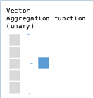

# RedAmber

[](https://badge.fury.io/rb/red_amber)
[](https://github.com/heronshoes/red_amber/actions/workflows/test.yml)

A simple dataframe library for Ruby.

- Powered by [Red Arrow](https://github.com/apache/arrow/tree/master/ruby/red-arrow) [](https://gitter.im/red-data-tools/en)
- Inspired by the dataframe library [Rover-df](https://github.com/ankane/rover)

## Requirements

Supported Ruby version is >= 2.7.

Since v0.2.0, this library uses pattern matching which is an experimental feature in 2.7 . It is usable but a warning message will be shown in 2.7 .
I recommend Ruby 3 for performance.

```ruby
# Libraries required
gem 'red-arrow',   '>= 9.0.0'

gem 'red-parquet', '>= 9.0.0' # Optional, if you use IO from/to parquet
gem 'rover-df',    '~> 0.3.0' # Optional, if you use IO from/to Rover::DataFrame
```

## Installation

Install requirements before you install Red Amber.

- Apache Arrow GLib (>= 9.0.0)

- Apache Parquet GLib (>= 9.0.0)  # If you use IO from/to parquet

  See [Apache Arrow install document](https://arrow.apache.org/install/).
  
  Minimum installation example for the latest Ubuntu is in the ['Prepare the Apache Arrow' section in ci test](https://github.com/heronshoes/red_amber/blob/master/.github/workflows/test.yml) of Red Amber.

Add this line to your Gemfile:

```ruby
gem 'red_amber'
```

And then execute:

```shell
bundle install
```

Or install it yourself as:

```shell
gem install red_amber
```

## Docker image and Jupyter Notebook

[RubyData Docker Stacks](https://github.com/RubyData/docker-stacks) is available as a ready-to-run Docker image containing Jupyter and useful data tools as well as RedAmber (Thanks to @mrkn).

Also you can try the contents of this README interactively by [Binder](https://mybinder.org/v2/gh/RubyData/docker-stacks/master?filepath=red-amber.ipynb). 
[](https://mybinder.org/v2/gh/RubyData/docker-stacks/master?filepath=red-amber.ipynb)


## `RedAmber::DataFrame`

Represents a set of data in 2D-shape. The entity is a Red Arrow's Table object. 

```ruby
require 'red_amber' # require 'red-amber' is also OK.
require 'datasets-arrow'

arrow = Datasets::Penguins.new.to_arrow
penguins = RedAmber::DataFrame.new(arrow)

# =>
#<RedAmber::DataFrame : 344 x 8 Vectors, 0x0000000000013790>
    species  island    bill_length_mm bill_depth_mm flipper_length_mm ...     year
    <string> <string>        <double>      <double>           <uint8> ... <uint16>
  1 Adelie   Torgersen           39.1          18.7               181 ...     2007
  2 Adelie   Torgersen           39.5          17.4               186 ...     2007
  3 Adelie   Torgersen           40.3          18.0               195 ...     2007
  4 Adelie   Torgersen          (nil)         (nil)             (nil) ...     2007
  5 Adelie   Torgersen           36.7          19.3               193 ...     2007
  : :        :                      :             :                 : ...        :
342 Gentoo   Biscoe              50.4          15.7               222 ...     2009
343 Gentoo   Biscoe              45.2          14.8               212 ...     2009
344 Gentoo   Biscoe              49.9          16.1               213 ...     2009
```

### DataFrame model


For example, `DataFrame#pick` accepts keys as an argument and returns a sub DataFrame.


```ruby
penguins.keys
# =>
[:species,                                       
 :island,                                        
 :bill_length_mm,
 :bill_depth_mm,
 :flipper_length_mm,
 :body_mass_g,
 :sex,
 :year]

df = penguins.pick(:species, :island, :body_mass_g)
df

# =>
#<RedAmber::DataFrame : 344 x 3 Vectors, 0x000000000003cc1c>
    species  island    body_mass_g
    <string> <string>     <uint16>
  1 Adelie   Torgersen        3750
  2 Adelie   Torgersen        3800
  3 Adelie   Torgersen        3250
  4 Adelie   Torgersen       (nil)
  5 Adelie   Torgersen        3450
  : :        :                   :
342 Gentoo   Biscoe           5750
343 Gentoo   Biscoe           5200
344 Gentoo   Biscoe           5400
```

`DataFrame#drop` drops some columns to create a remainer DataFrame.


You can specify by keys or a boolean array of same size as n_keys.

```ruby
# Same as df.drop(:species, :island)
df = df.drop(true, true, false)

# =>
#<RedAmber::DataFrame : 344 x 1 Vector, 0x0000000000048760>
    body_mass_g
       <uint16>
  1        3750
  2        3800
  3        3250
  4       (nil)
  5        3450
  :           :
342        5750
343        5200
344        5400
```

Arrow data is immutable, so these methods always return an new object.

`DataFrame#assign` creates new columns or update existing columns.


```ruby
# New column is created because ':body_mass_kg' is a new key.
df.assign(:body_mass_kg => df[:body_mass_g] / 1000.0)

# =>
#<RedAmber::DataFrame : 344 x 2 Vectors, 0x00000000000212f0>
    body_mass_g body_mass_kg
       <uint16>     <double>
  1        3750          3.8
  2        3800          3.8
  3        3250          3.3
  4       (nil)        (nil)
  5        3450          3.5
  :           :            :
342        5750          5.8
343        5200          5.2
344        5400          5.4
```

`DataFrame#slice` selects rows (observations) to create a sub DataFrame.


```ruby
# returns 5 rows at the start and 5 rows from the end
penguins.slice(0...5, -5..-1)

# =>
#<RedAmber::DataFrame : 10 x 8 Vectors, 0x0000000000042be4>
   species  island    bill_length_mm bill_depth_mm flipper_length_mm ...     year
   <string> <string>        <double>      <double>           <uint8> ... <uint16>
 1 Adelie   Torgersen           39.1          18.7               181 ...     2007
 2 Adelie   Torgersen           39.5          17.4               186 ...     2007
 3 Adelie   Torgersen           40.3          18.0               195 ...     2007
 4 Adelie   Torgersen          (nil)         (nil)             (nil) ...     2007
 5 Adelie   Torgersen           36.7          19.3               193 ...     2007
 : :        :                      :             :                 : ...        :
 8 Gentoo   Biscoe              50.4          15.7               222 ...     2009
 9 Gentoo   Biscoe              45.2          14.8               212 ...     2009
10 Gentoo   Biscoe              49.9          16.1               213 ...     2009
```

`DataFrame#remove` rejects rows (observations) to create a remainer DataFrame.


```ruby
# penguins[:bill_length_mm] < 40 returns a boolean Vector
penguins.remove(penguins[:bill_length_mm] < 40)

# =>
#<RedAmber::DataFrame : 244 x 8 Vectors, 0x000000000007d6f4>
    species  island    bill_length_mm bill_depth_mm flipper_length_mm ...     year
    <string> <string>        <double>      <double>           <uint8> ... <uint16>
  1 Adelie   Torgersen           40.3          18.0               195 ...     2007
  2 Adelie   Torgersen          (nil)         (nil)             (nil) ...     2007
  3 Adelie   Torgersen           42.0          20.2               190 ...     2007
  4 Adelie   Torgersen           41.1          17.6               182 ...     2007
  5 Adelie   Torgersen           42.5          20.7               197 ...     2007
  : :        :                      :             :                 : ...        :
242 Gentoo   Biscoe              50.4          15.7               222 ...     2009
243 Gentoo   Biscoe              45.2          14.8               212 ...     2009
244 Gentoo   Biscoe              49.9          16.1               213 ...     2009
```

DataFrame manipulating methods like `pick`, `drop`, `slice`, `remove`, `rename` and `assign` accept a block.

Previous example is also OK with a block.

```ruby
penguins.remove { bill_length_mm < 40 }
```

Next example is an usage of block to update a column.

```ruby
df = RedAmber::DataFrame.new(
  integer: [0, 1, 2, 3, nil],
  float:   [0.0, 1.1,  2.2, Float::NAN, nil],
  string:  ['A', 'B', 'C', 'D', nil],
  boolean: [true, false, true, false, nil])
df

# =>
#<RedAmber::DataFrame : 5 x 4 Vectors, 0x000000000003131c>
  integer    float string   boolean
  <uint8> <double> <string> <boolean>
1       0      0.0 A        true
2       1      1.1 B        false
3       2      2.2 C        true
4       3      NaN D        false
5   (nil)    (nil) (nil)    (nil)

df.assign do
  vectors.select(&:float?).map { |v| [v.key, -v] }
  # => returns [[:float], [-0.0, -1.1, -2.2, NAN, nil]]
end

# =>
#<RedAmber::DataFrame : 5 x 3 Vectors, 0x00000000000e270c>
    index    float string
  <uint8> <double> <string>
1       0     -0.0 A
2       1     -1.1 B
3       2     -2.2 C
4       3      NaN D
5   (nil)    (nil) (nil)
```

Next example is to eliminate rows containing nil.

```ruby
# remove all observations containing nil
nil_removed = penguins.remove { vectors.map(&:is_nil).reduce(&:|) }
nil_removed.tdr

# =>
RedAmber::DataFrame : 342 x 8 Vectors
Vectors : 5 numeric, 3 strings
# key                type   level data_preview
1 :species           string     3 {"Adelie"=>151, "Chinstrap"=>68, "Gentoo"=>123}
2 :island            string     3 {"Torgersen"=>51, "Biscoe"=>167, "Dream"=>124}
3 :bill_length_mm    double   164 [39.1, 39.5, 40.3, 36.7, 39.3, ... ]
4 :bill_depth_mm     double    80 [18.7, 17.4, 18.0, 19.3, 20.6, ... ]
5 :flipper_length_mm int64     55 [181, 186, 195, 193, 190, ... ]
6 :body_mass_g       int64     94 [3750, 3800, 3250, 3450, 3650, ... ]
7 :sex               string     3 {"male"=>168, "female"=>165, ""=>9}
8 :year              int64      3 {2007=>109, 2008=>114, 2009=>119}
```

For this frequently needed task, we can do it much simpler.

```ruby
penguins.remove_nil # => same result as above
```

`DataFrame#summary` shows summary statistics in a DataFrame.

```ruby
puts penguins.summary.to_s(width: 82)

# =>
  variables            count     mean      std      min      25%   median      75%      max
  <dictionary>      <uint16> <double> <double> <double> <double> <double> <double> <double>
1 bill_length_mm         342    43.92     5.46     32.1    39.23    44.38     48.5     59.6
2 bill_depth_mm          342    17.15     1.97     13.1     15.6    17.32     18.7     21.5
3 flipper_length_mm      342   200.92    14.06    172.0    190.0    197.0    213.0    231.0
4 body_mass_g            342  4201.75   801.95   2700.0   3550.0   4031.5   4750.0   6300.0
5 year                   344  2008.03     0.82   2007.0   2007.0   2008.0   2009.0   2009.0
```

`DataFrame#group` method can be used for the grouping tasks.

```ruby
starwars = RedAmber::DataFrame.load(URI("https://vincentarelbundock.github.io/Rdatasets/csv/dplyr/starwars.csv"))
starwars

# =>
#<RedAmber::DataFrame : 87 x 12 Vectors, 0x000000000000607c>
   unnamed1 name            height     mass hair_color skin_color  eye_color ... species
    <int64> <string>       <int64> <double> <string>   <string>    <string>  ... <string>
 1        1 Luke Skywalker     172     77.0 blond      fair        blue      ... Human
 2        2 C-3PO              167     75.0 NA         gold        yellow    ... Droid
 3        3 R2-D2               96     32.0 NA         white, blue red       ... Droid
 4        4 Darth Vader        202    136.0 none       white       yellow    ... Human
 5        5 Leia Organa        150     49.0 brown      light       brown     ... Human
 :        : :                    :        : :          :           :         ... :
85       85 BB8              (nil)    (nil) none       none        black     ... Droid
86       86 Captain Phasma   (nil)    (nil) unknown    unknown     unknown   ... NA
87       87 Padmé Amidala      165     45.0 brown      light       brown     ... Human

starwars.group(:species) { [count(:species), mean(:height, :mass)] }
        .slice { count > 1 }

# =>
#<RedAmber::DataFrame : 9 x 4 Vectors, 0x000000000006e848>
  species    count mean(height) mean(mass)
  <string> <int64>     <double>   <double>
1 Human         35        176.6       82.8
2 Droid          6        131.2       69.8
3 Wookiee        2        231.0      124.0
4 Gungan         3        208.7       74.0
5 NA             4        181.3       48.0
: :              :            :          :
7 Twi'lek        2        179.0       55.0
8 Mirialan       2        168.0       53.1
9 Kaminoan       2        221.0       88.0 
```

See [DataFrame.md](doc/DataFrame.md) for other examples and details.


## `RedAmber::Vector`

Class `RedAmber::Vector` represents a series of data in the DataFrame.
Method `RedAmber::DataFrame#[key]` returns a Vector with the key `key`. 

```ruby
penguins[:bill_length_mm]
# =>
#<RedAmber::Vector(:double, size=344):0x000000000000f8fc>
[39.1, 39.5, 40.3, nil, 36.7, 39.3, 38.9, 39.2, 34.1, 42.0, 37.8, 37.8, 41.1, ... ]
```

Vectors accepts some [functional methods from Arrow](https://arrow.apache.org/docs/cpp/compute.html).

This is an element-wise comparison and returns a boolean Vector of same size.


```ruby
penguins[:bill_length_mm] < 40

# =>
#<RedAmber::Vector(:boolean, size=344):0x000000000007e7ac>
[true, true, false, nil, true, true, true, true, true, false, true, true, false, ... ]
```

Next example returns aggregated result.



```ruby
penguins[:bill_length_mm].mean
43.92192982456141
# =>

```

See [Vector.md](doc/Vector.md) for details.

## Jupyter notebook

[61 Examples of Red Amber](doc/examples_of_red_amber.ipynb) shows more examples in jupyter notebook.

## Development

```shell
git clone https://github.com/heronshoes/red_amber.git
cd red_amber
bundle install
bundle exec rake test
```

I will appreciate if you could help to improve this project. Here are a few ways you can help:

- [Report bugs or suggest new features](https://github.com/heronshoes/red_amber/issues)
- Fix bugs and [submit pull requests](https://github.com/heronshoes/red_amber/pulls)
- Write, clarify, or fix documentation

## License

The gem is available as open source under the terms of the [MIT License](https://opensource.org/licenses/MIT).
