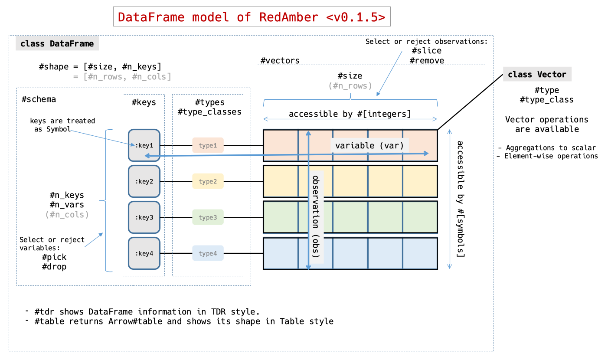
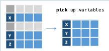
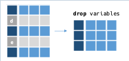
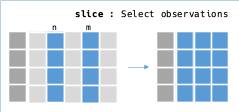
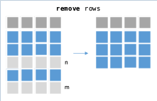
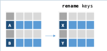
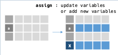
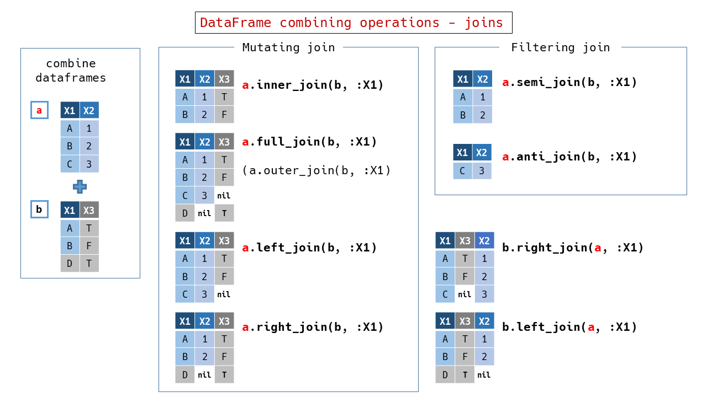
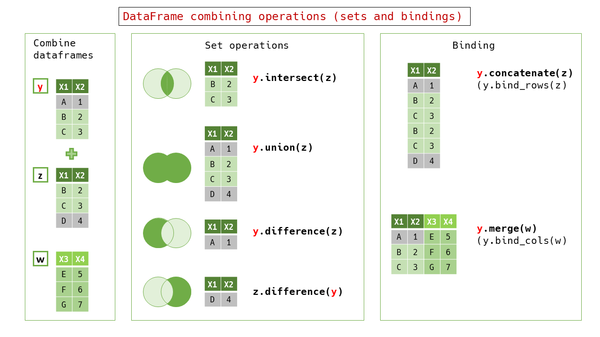

# DataFrame

Class `RedAmber::DataFrame` represents 2D-data. A `DataFrame` consists with:
- A collection of data which have same data type within. We call it `Vector`.
- A label is attached to `Vector`. We call it `key`.
- A `Vector` and associated `key` is grouped as a `variable`.
- `variable`s with same vector length are aligned and arranged to be a `DataFrame`.
  - Each `key` in a `DataFrame` must be unique.
- Each `Vector` in a `DataFrame` contains a set of relating data at same position. We call it `record` or `observation`.



## Constructors and saving

### `new` from a Hash

  ```ruby
  df = RedAmber::DataFrame.new(x: [1, 2, 3], y: %w[A B C])
  ```

### `new` from a schema (by Hash) and data (by Array)

  ```ruby
  RedAmber::DataFrame.new({x: :uint8, y: :string}, [[1, "A"], [2, "B"], [3, "C"]])
  ```

### `new` from an Arrow::Table


  ```ruby
  table = Arrow::Table.new(x: [1, 2, 3], y: %w[A B C])
  RedAmber::DataFrame.new(table)
  ```

### `new` from an Object which responds to `to_arrow`

  ```ruby
  require "datasets-arrow"
  dataset = Datasets::Penguins.new
  RedAmber::DataFrame.new(dataset)
  ```

### `new` from a Rover::DataFrame


  ```ruby
  require 'rover'

  rover = Rover::DataFrame.new(x: [1, 2, 3], y: %w[A B C])
  RedAmber::DataFrame.new(rover)
  ```

### `load` (class method)

- from a `.arrow`, `.arrows`, `.csv`, `.csv.gz` or `.tsv` file
       
  ```ruby
  RedAmber::DataFrame.load("test/entity/with_header.csv")
  ```
  
  ```ruby
  RedAmber::DataFrame.load("test/entity/without_header.csv", headers: [:x, :y, :z])
  ```

- from a string buffer

- from a URI

  ```ruby
  uri = URI("https://raw.githubusercontent.com/mwaskom/seaborn-data/master/penguins.csv")
  RedAmber::DataFrame.load(uri)
  ```

- from a Parquet file

  ```ruby
  require 'parquet'

  df = RedAmber::DataFrame.load("file.parquet")
  ```

### `save` (instance method)

- to a `.arrow`, `.arrows`, `.csv`, `.csv.gz` or `.tsv` file

- to a string buffer

- to a URI

- to a Parquet file

  ```ruby
  require 'parquet'

  df.save("file.parquet")
  ```

## Properties

### `table`, `to_arrow`

- Returns Arrow::Table object in the DataFrame.

### `size`, `n_records`, `n_obs`, `n_rows`
  
- Returns size of Vector (num of records).

### `n_keys`, `n_variables`, `n_vars`, `n_cols`,
  
- Returns num of keys (num of variables).
 
### `shape`
 
- Returns shape in an Array[n_rows, n_cols].

### `variables`

- Returns key names and Vectors pair in a Hash.

  It is convenient to use in a block when both key and vector required. We will write:

  ```ruby
    # update numeric variables
    df.assign do
      variables.select.with_object({}) do |(key, vector), assigner|
        assigner[key] = vector * -1 if vector.numeric?
      end
    end
  ```

  Instead of:
  ```ruby
    df.assign do
      assigner = {}
      vectors.each_with_index do |vector, i|
        assigner[keys[i]] = vector * -1 if vector.numeric?
      end
      assigner
    end
  ```

### `keys`, `var_names`, `column_names`
  
- Returns key names in an Array.

  Each key must be unique in the DataFrame.

### `types`
  
- Returns types of vectors in an Array of Symbols.

### `type_classes`

- Returns types of vector in an Array of `Arrow::DataType`.

### `vectors`

- Returns an Array of Vectors.

  When we use it, Vector#key is useful to get the key in the DataFrame.

  ```ruby
    # update numeric variables, another solution
    df.assign do
      vectors.each_with_object({}) do |vector, assigner|
        assigner[vector.key] = vector * -1 if vector.numeric?
      end
    end
  ```

### `indices`, `indexes`

- Returns indexes in a Vector.
  Accepts an option `start` as the first of indexes.

  ```ruby
  df = RedAmber::DataFrame.new(x: [1, 2, 3, 4, 5])
  df.indices

  # =>
  #<RedAmber::Vector(:uint8, size=5):0x0000000000013ed4>
  [0, 1, 2, 3, 4]

  df.indices(1)

  # =>
  #<RedAmber::Vector(:uint8, size=5):0x0000000000018fd8>
  [1, 2, 3, 4, 5]

  df.indices(:a)

  # =>
  #<RedAmber::Vector(:dictionary, size=5):0x000000000001bd50>
  [:a, :b, :c, :d, :e]
  ```

### `to_h`

- Returns column-oriented data in a Hash.

### `to_a`, `raw_records`

- Returns an array of row-oriented data without header.
  
  If you need a column-oriented full array, use `.to_h.to_a`

### `each_row`

  Yield each row in a `{ key => row}` Hash.
  Returns Enumerator if block is not given.

### `schema`

- Returns column name and data type in a Hash.

### `==`
 
### `empty?`

## Output

### `to_s`

`to_s` returns a preview of the Table.

```ruby
puts penguins.to_s

# =>
    species  island    bill_length_mm bill_depth_mm flipper_length_mm ...     year
    <string> <string>        <double>      <double>           <uint8> ... <uint16>
  0 Adelie   Torgersen           39.1          18.7               181 ...     2007
  1 Adelie   Torgersen           39.5          17.4               186 ...     2007
  2 Adelie   Torgersen           40.3          18.0               195 ...     2007
  3 Adelie   Torgersen          (nil)         (nil)             (nil) ...     2007
  4 Adelie   Torgersen           36.7          19.3               193 ...     2007
  : :        :                      :             :                 : ...        :
341 Gentoo   Biscoe              50.4          15.7               222 ...     2009
342 Gentoo   Biscoe              45.2          14.8               212 ...     2009
343 Gentoo   Biscoe              49.9          16.1               213 ...     2009
```
### `inspect`

`inspect` uses `to_s` output and also shows shape and object_id.


### `summary`, `describe`

`DataFrame#summary` or `DataFrame#describe` shows summary statistics in a DataFrame.

```ruby
puts penguins.summary.to_s(width: 82) # needs more width to show all stats in this example

# =>
  variables            count     mean      std      min      25%   median      75%      max
  <dictionary>      <uint16> <double> <double> <double> <double> <double> <double> <double>
0 bill_length_mm         342    43.92     5.46     32.1    39.23    44.38     48.5     59.6
1 bill_depth_mm          342    17.15     1.97     13.1     15.6    17.32     18.7     21.5
2 flipper_length_mm      342   200.92    14.06    172.0    190.0    197.0    213.0    231.0
3 body_mass_g            342  4201.75   801.95   2700.0   3550.0   4031.5   4750.0   6300.0
4 year                   344  2008.03     0.82   2007.0   2007.0   2008.0   2009.0   2009.0
```

### `to_rover`

- Returns a `Rover::DataFrame`.

```ruby
require 'rover'

penguins.to_rover
```

### `to_iruby`

- Show the DataFrame as a Table in Jupyter Notebook or Jupyter Lab with IRuby.

### `tdr(limit = 10, tally: 5, elements: 5)`

  - Shows some information about self in a transposed style.
  - `tdr_str` returns same info as a String.
  - `glimpse` is an alias. It is similar to dplyr's (or Polars's) `glimpse()`.

  ```ruby
  require 'red_amber'
  require 'datasets-arrow'

  dataset = Datasets::Penguins.new
  # (From 0.2.2) responsible to the object which has `to_arrow` method.
  # If older, it should be `dataset.to_arrow` in the parentheses.
  RedAmber::DataFrame.new(dataset).tdr

  # =>
  RedAmber::DataFrame : 344 x 8 Vectors
  Vectors : 5 numeric, 3 strings
  # key                type   level data_preview
  0 :species           string     3 {"Adelie"=>152, "Chinstrap"=>68, "Gentoo"=>124}
  1 :island            string     3 {"Torgersen"=>52, "Biscoe"=>168, "Dream"=>124}
  2 :bill_length_mm    double   165 [39.1, 39.5, 40.3, nil, 36.7, ... ], 2 nils
  3 :bill_depth_mm     double    81 [18.7, 17.4, 18.0, nil, 19.3, ... ], 2 nils
  4 :flipper_length_mm uint8     56 [181, 186, 195, nil, 193, ... ], 2 nils
  5 :body_mass_g       uint16    95 [3750, 3800, 3250, nil, 3450, ... ], 2 nils
  6 :sex               string     3 {"male"=>168, "female"=>165, nil=>11}
  7 :year              uint16     3 {2007=>110, 2008=>114, 2009=>120}
  ```
  
  Options:
  - limit: limit of variables to show. Default value is 10.
  - tally: max level to use tally mode. Default value is 5.
  - elements: max num of element to show values in each records. Default value is 5.

## Selecting

### Select variables (columns in a table) by `[]` as `[key]`, `[keys]`, `[keys[index]]`
- Key in a Symbol: `df[:symbol]`
- Key in a String: `df["string"]`
- Keys in an Array: `df[:symbol1, "string", :symbol2]`
- Keys by indeces: `df[df.keys[0]`, `df[df.keys[1,2]]`, `df[df.keys[1..]]`

  Key indeces should be used via `keys[i]` because numbers are used to select records (rows). See next section.

- Keys by a Range:

  If keys are able to represent by a Range, it can be included in the arguments. See a example below.

- You can also exchange the order of variables (columns).
 
  ```ruby
  hash = {a: [1, 2, 3], b: %w[A B C], c: [1.0, 2, 3]}
  df = RedAmber::DataFrame.new(hash)
  df[:b..:c, "a"]

  # =>
  #<RedAmber::DataFrame : 3 x 3 Vectors, 0x00000000000328fc>
    b               c       a
    <string> <double> <uint8>
  0 A             1.0       1
  1 B             2.0       2
  2 C             3.0       3
  ```

  If `#[]` represents a single variable (column), it returns a Vector object.

  ```ruby
  df[:a]

  # =>
  #<RedAmber::Vector(:uint8, size=3):0x000000000000f140>
  [1, 2, 3]
  ```

  Or `#v` method also returns a Vector for a key.

  ```ruby
  df.v(:a)

  # =>
  #<RedAmber::Vector(:uint8, size=3):0x000000000000f140>
  [1, 2, 3]
  ```

  This method may be useful to use in a block of DataFrame manipulation verbs. We can write `v(:a)` rather than `self[:a]` or `df[:a]`

### Select records (rows in a table) by `[]` as `[index]`, `[range]`, `[array]`

- Select a record by index: `df[0]`

- Select records by indeces in an Array: `df[1, 2]`

- Select records by indeces in a Range: `df[1..2]`

  An end-less or a begin-less Range can be used to represent indeces.

- You can use indices in Float.

- Mixed case: `df[2, 0..]`

  ```ruby
  hash = {a: [1, 2, 3], b: %w[A B C], c: [1.0, 2, 3]}
  df = RedAmber::DataFrame.new(hash)
  df[2, 0..]

  # =>
  #<RedAmber::DataFrame : 4 x 3 Vectors, 0x0000000000033270>
          a b               c
    <uint8> <string> <double>
  0       3 C             3.0
  1       1 A             1.0
  2       2 B             2.0
  3       3 C             3.0
  ```

- Select records by a boolean Array or a boolean RedAmber::Vector at same size as self.

  It returns a sub dataframe with records at boolean is true.

    ```ruby
    # with the same dataframe `df` above
    df[true, false, nil] # or
    df[[true, false, nil]] # or
    df[RedAmber::Vector.new([true, false, nil])]

    # =>
    #<RedAmber::DataFrame : 1 x 3 Vectors, 0x00000000000353e0>
            a b               c
      <uint8> <string> <double>
    1       1 A             1.0
    ```

### Select records (rows) from top or from bottom

  `head(n=5)`, `tail(n=5)`, `first(n=1)`, `last(n=1)`

## Sub DataFrame manipulations

### `pick  ` - pick up variables -

  Pick up some variables (columns) to create a sub DataFrame.

  

- Keys as arguments

  `pick(keys)` accepts keys as arguments in an Array or a Range.

    ```ruby
    penguins.pick(:species, :bill_length_mm)

    # =>
    #<RedAmber::DataFrame : 344 x 2 Vectors, 0x0000000000035ebc>
        species  bill_length_mm
        <string>       <double>
      0 Adelie             39.1
      1 Adelie             39.5
      2 Adelie             40.3
      3 Adelie            (nil)
      4 Adelie             36.7
      : :                     :
    341 Gentoo             50.4
    342 Gentoo             45.2
    343 Gentoo             49.9
    ```

- Indices as arguments

  `pick(indices)` accepts indices as arguments. Indices should be Integers, Floats or Ranges of Integers.

    ```ruby
    penguins.pick(0..2, -1)
    
    # =>
    #<RedAmber::DataFrame : 344 x 4 Vectors, 0x0000000000055ce4>
        species  island    bill_length_mm     year
        <string> <string>        <double> <uint16>
      0 Adelie   Torgersen           39.1     2007
      1 Adelie   Torgersen           39.5     2007
      2 Adelie   Torgersen           40.3     2007
      3 Adelie   Torgersen          (nil)     2007
      4 Adelie   Torgersen           36.7     2007
      : :        :                      :        :
    341 Gentoo   Biscoe              50.4     2009
    342 Gentoo   Biscoe              45.2     2009
    343 Gentoo   Biscoe              49.9     2009
    ```

- Booleans as arguments

  `pick(booleans)` accepts booleans as arguments in an Array. Booleans must be same length as `n_keys`.

    ```ruby
    penguins.pick(penguins.vectors.map(&:string?))
    
    # =>
    #<RedAmber::DataFrame : 344 x 3 Vectors, 0x00000000000387ac>
        species  island    sex
        <string> <string>  <string>
      0 Adelie   Torgersen male
      1 Adelie   Torgersen female
      2 Adelie   Torgersen female
      3 Adelie   Torgersen (nil)
      4 Adelie   Torgersen female
      : :        :         :
    341 Gentoo   Biscoe    male
    342 Gentoo   Biscoe    female
    343 Gentoo   Biscoe    male
    ```

- Keys or booleans by a block

    `pick {block}` is also acceptable. We can't use both arguments and a block at a same time. The block should return keys, indices or a boolean Array with a same length as `n_keys`. Block is called in the context of self.

    ```ruby
    penguins.pick { keys.map { |key| key.end_with?('mm') } }

    # =>
    #<RedAmber::DataFrame : 344 x 3 Vectors, 0x000000000003dd4c>
        bill_length_mm bill_depth_mm flipper_length_mm
              <double>      <double>           <uint8>
      0           39.1          18.7               181
      1           39.5          17.4               186
      2           40.3          18.0               195
      3          (nil)         (nil)             (nil)
      4           36.7          19.3               193
      :              :             :                 :
    341           50.4          15.7               222
    342           45.2          14.8               212
    343           49.9          16.1               213
    ```

### `drop  ` - counterpart of pick -

  Drop some variables (columns) to create a remainer DataFrame.

  

- Keys as arguments

  `drop(keys)` accepts keys as arguments in an Array or a Range.

- Indices as arguments

  `drop(indices)` accepts indices as a arguments. Indices should be Integers, Floats or Ranges of Integers.

- Booleans as arguments

  `drop(booleans)` accepts booleans as an argument in an Array. Booleans must be same length as `n_keys`.

- Keys or booleans by a block

  `drop {block}` is also acceptable. We can't use both arguments and a block at a same time. The block should return keys, indices or a boolean Array with a same length as `n_keys`. Block is called in the context of self.
  
- Notice for nil

  When used with booleans, nil in booleans is treated as a false. This behavior is aligned with Ruby's `nil#!`.

  ```ruby
  booleans = [true, false, nil]
  booleans_invert = booleans.map(&:!) # => [false, true, true]
  df.pick(booleans) == df.drop(booleans_invert) # => true
  ```
- Difference between `pick`/`drop` and `[]`

  If `pick` or `drop` will select a single variable (column), it returns a `DataFrame` with one variable. In contrast, `[]` returns a `Vector`. This behavior may be useful to use in a block of DataFrame manipulations.

  ```ruby
  df = RedAmber::DataFrame.new(a: [1, 2, 3], b: %w[A B C], c: [1.0, 2, 3])
  df.pick(:a) # or
  df.drop(:b, :c)

  # =>
  #<RedAmber::DataFrame : 3 x 1 Vector, 0x000000000003f4bc>
          a
    <uint8>
  0       1
  1       2
  2       3

  df[:a]

  # =>
  #<RedAmber::Vector(:uint8, size=3):0x000000000000f258>
  [1, 2, 3]
  ```

  A simple key name is usable as a method of the DataFrame if the key name is acceptable as a method name.
  It returns a Vector same as `[]`.

  ```ruby
  df.a

  # =>
  #<RedAmber::Vector(:uint8, size=3):0x000000000000f258>
  [1, 2, 3]
  ```

### `slice  `  - cut into slices of records -

  Slice and select records (rows) to create a sub DataFrame.

  

- Indices as arguments

    `slice(indeces)` accepts indices as arguments. Indices should be Integers, Floats or Ranges of Integers.

    Negative index from the tail like Ruby's Array is also acceptable.

    ```ruby
    # returns 5 records at start and 5 records from end
    penguins.slice(0...5, -5..-1)

    # =>
    #<RedAmber::DataFrame : 10 x 8 Vectors, 0x0000000000042be4>
      species  island    bill_length_mm bill_depth_mm flipper_length_mm ...     year
      <string> <string>        <double>      <double>           <uint8> ... <uint16>
    0 Adelie   Torgersen           39.1          18.7               181 ...     2007
    1 Adelie   Torgersen           39.5          17.4               186 ...     2007
    2 Adelie   Torgersen           40.3          18.0               195 ...     2007
    3 Adelie   Torgersen          (nil)         (nil)             (nil) ...     2007
    4 Adelie   Torgersen           36.7          19.3               193 ...     2007
    : :        :                      :             :                 : ...        :
    7 Gentoo   Biscoe              50.4          15.7               222 ...     2009
    8 Gentoo   Biscoe              45.2          14.8               212 ...     2009
    9 Gentoo   Biscoe              49.9          16.1               213 ...     2009
    ```

- Booleans as an argument

  `filter(booleans)` or `slice(booleans)` accepts booleans as an argument in an Array, a Vector or an Arrow::BooleanArray . Booleans must be same length as `size`.

  note: `slice(booleans)` is acceptable for orthogonality of `slice`/`remove`.

    ```ruby
    vector = penguins[:bill_length_mm]
    penguins.filter(vector >= 40)
    # penguins.slice(vector >= 40) is also acceptable

    # =>
    #<RedAmber::DataFrame : 242 x 8 Vectors, 0x0000000000043d3c>
        species  island    bill_length_mm bill_depth_mm flipper_length_mm ...     year
        <string> <string>        <double>      <double>           <uint8> ... <uint16>
      0 Adelie   Torgersen           40.3          18.0               195 ...     2007
      1 Adelie   Torgersen           42.0          20.2               190 ...     2007
      2 Adelie   Torgersen           41.1          17.6               182 ...     2007
      3 Adelie   Torgersen           42.5          20.7               197 ...     2007
      4 Adelie   Torgersen           46.0          21.5               194 ...     2007
      : :        :                      :             :                 : ...        :
    239 Gentoo   Biscoe              50.4          15.7               222 ...     2009
    240 Gentoo   Biscoe              45.2          14.8               212 ...     2009
    241 Gentoo   Biscoe              49.9          16.1               213 ...     2009
    ```

- Indices or booleans by a block

    `slice {block}` is also acceptable. We can't use both arguments and a block at a same time. The block should return indeces or a boolean Array with a same length as `size`. Block is called in the context of self.

    ```ruby
    # return a DataFrame with bill_length_mm is in 2*std range around mean
    penguins.slice do
      vector = self[:bill_length_mm]
      min = vector.mean - vector.std
      max = vector.mean + vector.std
      vector.to_a.map { |e| (min..max).include? e }
    end

    # =>
    #<RedAmber::DataFrame : 204 x 8 Vectors, 0x0000000000047a40>
        species  island    bill_length_mm bill_depth_mm flipper_length_mm ...     year
        <string> <string>        <double>      <double>           <uint8> ... <uint16>
      0 Adelie   Torgersen           39.1          18.7               181 ...     2007
      1 Adelie   Torgersen           39.5          17.4               186 ...     2007
      2 Adelie   Torgersen           40.3          18.0               195 ...     2007
      3 Adelie   Torgersen           39.3          20.6               190 ...     2007
      4 Adelie   Torgersen           38.9          17.8               181 ...     2007
      : :        :                      :             :                 : ...        :
    201 Gentoo   Biscoe              47.2          13.7               214 ...     2009
    202 Gentoo   Biscoe              46.8          14.3               215 ...     2009
    203 Gentoo   Biscoe              45.2          14.8               212 ...     2009
    ```

- Notice: nil option
  - `Arrow::Table#slice` uses `filter` method with a option `Arrow::FilterOptions.null_selection_behavior = :emit_null`. This will propagate nil at the same row.
    
    ```ruby
    hash = { a: [1, 2, 3], b: %w[A B C], c: [1.0, 2, 3] }
    table = Arrow::Table.new(hash)
    table.slice([true, false, nil])

    # =>
    #<Arrow::Table:0x7fdfe44b9e18 ptr=0x555e9fe744d0>
	         a	b	            c
    0	     1  A      1.000000
    1	(null)	(null)   (null)
    ```

  - Whereas in RedAmber, `DataFrame#slice` with booleans containing nil is treated as false. This behavior comes from `Allow::FilterOptions.null_selection_behavior = :drop`. This is  a default value for `Arrow::Table.filter` method.

    ```ruby
    RedAmber::DataFrame.new(table).slice([true, false, nil]).table

    # =>
    #<Arrow::Table:0x7fdfe44981c8 ptr=0x555e9febc330>
	    a	b	         c
    0	1	A	  1.000000
    ``` 

### `remove` - counterpart of slice -

  Slice and reject records (rows) to create a remainer DataFrame.

  

- Indices as arguments

    `remove(indeces)` accepts indeces as arguments. Indeces should be an Integer or a Range of Integer.

    ```ruby
    # returns 6th to 339th records
    penguins.remove(0...5, -5..-1)

    # =>
    #<RedAmber::DataFrame : 334 x 8 Vectors, 0x00000000000487c4>
        species  island    bill_length_mm bill_depth_mm flipper_length_mm ...     year
        <string> <string>        <double>      <double>           <uint8> ... <uint16>
      0 Adelie   Torgersen           39.3          20.6               190 ...     2007
      1 Adelie   Torgersen           38.9          17.8               181 ...     2007
      2 Adelie   Torgersen           39.2          19.6               195 ...     2007
      3 Adelie   Torgersen           34.1          18.1               193 ...     2007
      4 Adelie   Torgersen           42.0          20.2               190 ...     2007
      : :        :                      :             :                 : ...        :
    331 Gentoo   Biscoe              44.5          15.7               217 ...     2009
    332 Gentoo   Biscoe              48.8          16.2               222 ...     2009
    333 Gentoo   Biscoe              47.2          13.7               214 ...     2009
    ```

- Booleans as an argument

  `remove(booleans)` accepts booleans as an argument in an Array, a Vector or an Arrow::BooleanArray . Booleans must be same length as `size`.

    ```ruby
    # remove all records contains nil
    removed = penguins.remove { vectors.map(&:is_nil).reduce(&:|) }
    removed

    # =>
    #<RedAmber::DataFrame : 333 x 8 Vectors, 0x0000000000049fac>
        species  island    bill_length_mm bill_depth_mm flipper_length_mm ...     year
        <string> <string>        <double>      <double>           <uint8> ... <uint16>
      0 Adelie   Torgersen           39.1          18.7               181 ...     2007
      1 Adelie   Torgersen           39.5          17.4               186 ...     2007
      2 Adelie   Torgersen           40.3          18.0               195 ...     2007
      3 Adelie   Torgersen           36.7          19.3               193 ...     2007
      4 Adelie   Torgersen           39.3          20.6               190 ...     2007
      : :        :                      :             :                 : ...        :
    330 Gentoo   Biscoe              50.4          15.7               222 ...     2009
    331 Gentoo   Biscoe              45.2          14.8               212 ...     2009
    332 Gentoo   Biscoe              49.9          16.1               213 ...     2009
    ```

- Indices or booleans by a block

    `remove {block}` is also acceptable. We can't use both arguments and a block at a same time. The block should return indeces or a boolean Array with a same length as `size`. Block is called in the context of self.

    ```ruby
    penguins.remove do
      # We will use another style shown in slice
      # self.bill_length_mm returns Vector
      mean = bill_length_mm.mean
      min = mean - bill_length_mm.std
      max = mean + bill_length_mm.std
      bill_length_mm.to_a.map { |e| (min..max).include? e }
    end

    # =>
    #<RedAmber::DataFrame : 140 x 8 Vectors, 0x000000000004de40>
        species  island    bill_length_mm bill_depth_mm flipper_length_mm ...     year
        <string> <string>        <double>      <double>           <uint8> ... <uint16>
      0 Adelie   Torgersen          (nil)         (nil)             (nil) ...     2007
      1 Adelie   Torgersen           36.7          19.3               193 ...     2007
      2 Adelie   Torgersen           34.1          18.1               193 ...     2007
      3 Adelie   Torgersen           37.8          17.1               186 ...     2007
      4 Adelie   Torgersen           37.8          17.3               180 ...     2007
      : :        :                      :             :                 : ...        :
    137 Gentoo   Biscoe             (nil)         (nil)             (nil) ...     2009
    138 Gentoo   Biscoe              50.4          15.7               222 ...     2009
    139 Gentoo   Biscoe              49.9          16.1               213 ...     2009
    ```

- Notice for nil
  - When `remove` used with booleans, nil in booleans is treated as false. This behavior is aligned with Ruby's `nil#!`.

    ```ruby
    df = RedAmber::DataFrame.new(a: [1, 2, nil], b: %w[A B C], c: [1.0, 2, 3])
    booleans = df[:a] < 2
    booleans

    # =>
    #<RedAmber::Vector(:boolean, size=3):0x000000000000f410>
    [true, false, nil]

    booleans_invert = booleans.to_a.map(&:!) # => [false, true, true]
    
    df.slice(booleans) == df.remove(booleans_invert) # => true
    ```

  - Whereas `Vector#invert` returns nil for elements nil. This will bring different result.

    ```ruby
    booleans.invert

    # =>
    #<RedAmber::Vector(:boolean, size=3):0x000000000000f488>
    [false, true, nil]

    df.remove(booleans.invert)

    # =>
    #<RedAmber::DataFrame : 2 x 3 Vectors, 0x000000000005df98>
            a b               c
      <uint8> <string> <double>
    0       1 A             1.0
    1   (nil) C             3.0
    ```

### `rename`

  Rename keys (variable/column names) to create a updated DataFrame.

  

- Key pairs as arguments

    `rename(key_pairs)` accepts key_pairs as arguments. key_pairs should be a Hash of `{existing_key => new_key}` or an Array of Arrays like `[[existing_key, new_key], ... ]`.

    ```ruby
    df = RedAmber::DataFrame.new( 'name' => %w[Yasuko Rui Hinata], 'age' => [68, 49, 28] )
    df.rename(:age => :age_in_1993)

    # =>
    #<RedAmber::DataFrame : 3 x 2 Vectors, 0x0000000000060838>
      name     age_in_1993
      <string>     <uint8>
    0 Yasuko            68
    1 Rui               49
    2 Hinata            28
    ```

- Key pairs by a block

    `rename {block}` is also acceptable. We can't use both arguments and a block at a same time. The block should return key_pairs as a Hash of `{existing_key => new_key}` or an Array of Arrays like `[[existing_key, new_key], ... ]`. Block is called in the context of self.

- Not existing keys

    If specified `existing_key` is not exist, raise a `DataFrameArgumentError`.

- Key type

  Symbol key and String key are distinguished.

### `assign`

  Assign new or updated variables (columns) and create an updated DataFrame.

  - Variables with new keys will append new columns from right.
  - Variables with exisiting keys will update corresponding vectors.

    

- Variables as arguments

    `assign(key_value_pairs)` accepts pairs of key and values as parameters. `key_value_pairs` should be a Hash of `{key => array_like}` or an Array of Arrays like `[[key, array_like], ... ]`. `array_like` is ether `Vector`, `Array` or `Arrow::Array`.

    ```ruby
    df = RedAmber::DataFrame.new(
      name: %w[Yasuko Rui Hinata],
      age: [68, 49, 28])
    df
    
    # =>
    #<RedAmber::DataFrame : 3 x 2 Vectors, 0x0000000000062804>
      name         age
      <string> <uint8>
    0 Yasuko        68
    1 Rui           49
    2 Hinata        28

    # update :age and add :brother
    df.assign(
      {
        age: age + 29,
        brother: ['Santa', nil, 'Momotaro']
      }
    )

    # =>
    #<RedAmber::DataFrame : 3 x 3 Vectors, 0x00000000000658b0>
      name         age brother
      <string> <uint8> <string>
    0 Yasuko        97 Santa
    1 Rui           78 (nil)
    2 Hinata        57 Momotaro
    ```

- Key pairs by a block

    `assign {block}` is also acceptable. We can't use both arguments and a block at a same time. The block should return pairs of key and values as a Hash of `{key => array_like}` or an Array of Arrays like `[[key, array_like], ... ]`. `array_like` is ether `Vector`, `Array` or `Arrow::Array`. The block is called in the context of self.

    ```ruby
    df = RedAmber::DataFrame.new(
      index: [0, 1, 2, 3, nil],
      float: [0.0, 1.1,  2.2, Float::NAN, nil],
      string: ['A', 'B', 'C', 'D', nil]
    )
    df

    # =>
    #<RedAmber::DataFrame : 5 x 3 Vectors, 0x0000000000069e60>
        index    float string
      <uint8> <double> <string>
    0       0      0.0 A
    1       1      1.1 B
    2       2      2.2 C
    3       3      NaN D
    4   (nil)    (nil) (nil)

    # update :float
    # assigner by an Array
    df.assign do
      vectors.select(&:float?)
             .map { |v| [v.key, -v] }
    end

    # =>
    #<RedAmber::DataFrame : 5 x 3 Vectors, 0x00000000000dfffc>
        index    float string
      <uint8> <double> <string>
    0       0     -0.0 A
    1       1     -1.1 B
    2       2     -2.2 C
    3       3      NaN D
    4   (nil)    (nil) (nil)

    # Or we can use assigner by a Hash
    df.assign do
      vectors.select.with_object({}) do |v, assigner|
        assigner[v.key] = -v if v.float?
      end
    end

    # => same as above
    ```

- Key type

  Symbol key and String key are considered as the same key.

- Empty assignment
  
  If assigner is empty or nil, returns self.

- Append from left

  `assign_left` method accepts the same parameters and block as `assign`, but append new columns from left.

  ```ruby
  df.assign_left(new_index: df.indices(1))
  
  # => 
  #<RedAmber::DataFrame : 5 x 4 Vectors, 0x000000000001787c>
    new_index   index    float string
      <uint8> <uint8> <double> <string>
  0         1       0      0.0 A
  1         2       1      1.1 B
  2         3       2      2.2 C
  3         4       3      NaN D
  4         5   (nil)    (nil) (nil)
  ```

### `slice_by(key, keep_key: false) { block }`

`slice_by` accepts a key and a block to select rows.

(Since 0.2.1)

  ```ruby
  df = RedAmber::DataFrame.new(
    index: [0, 1, 2, 3, nil],
    float: [0.0, 1.1,  2.2, Float::NAN, nil],
    string: ['A', 'B', 'C', 'D', nil]
  )
  df

  # =>
  #<RedAmber::DataFrame : 5 x 3 Vectors, 0x0000000000069e60>
      index    float string
    <uint8> <double> <string>
  0       0      0.0 A
  1       1      1.1 B
  2       2      2.2 C
  3       3      NaN D
  4   (nil)    (nil) (nil)

  df.slice_by(:string) { ["A", "C"] }

  # =>
  #<RedAmber::DataFrame : 2 x 2 Vectors, 0x000000000001b1ac>
      index    float
    <uint8> <double>
  0       0      0.0
  1       2      2.2
  ```

It is the same behavior as;

  ```ruby
  df.slice { [string.index("A"), string.index("C")] }.drop(:string)
  ```

`slice_by` also accepts a Range.

  ```ruby
  df.slice_by(:string) { "A".."C" }

  # =>
  #<RedAmber::DataFrame : 3 x 2 Vectors, 0x0000000000069668>
      index    float
    <uint8> <double>
  0       0      0.0
  1       1      1.1
  2       2      2.2
  ```

When the option `keep_key: true` used, the column `key` will be preserved.

  ```ruby
  df.slice_by(:string, keep_key: true) { "A".."C" }

  # =>
  #<RedAmber::DataFrame : 3 x 3 Vectors, 0x0000000000073c44>
      index    float string
    <uint8> <double> <string>
  0       0      0.0 A
  1       1      1.1 B
  2       2      2.2 C
  ```

## Updating

### `sort`

  `sort` accepts parameters as sort_keys thanks to the Red Arrow's feature。
    - :key, "key" or "+key" denotes ascending order
    - "-key" denotes descending order

  ```ruby
  df = RedAmber::DataFrame.new(
        index:  [1, 1, 0, nil, 0],
        string: ['C', 'B', nil, 'A', 'B'],
        bool:   [nil, true, false, true, false],
      )
  df.sort(:index, '-bool')
  
  # =>
  #<RedAmber::DataFrame : 5 x 3 Vectors, 0x000000000009b03c>
      index string   bool
    <uint8> <string> <boolean>
  0       0 (nil)    false
  1       0 B        false
  2       1 B        true
  3       1 C        (nil)
  4   (nil) A        true
  ```

- [ ] Clamp

- [ ] Clear data

## Treat na data

### `remove_nil`

  Remove any records containing nil.

## Grouping

### `group(group_keys)`

  `group` creates a instance of class `Group`. `Group` accepts functions below as a method.
  Method accepts options as `group_keys`.

  Available functions are:

  - [ ] all                 
  - [ ] any
  - [ ] approximate_median
  - ✓ count
  - [ ] count_distinct
  - [ ] distinct
  - ✓ max
  - ✓ mean
  - ✓ min
  - [ ] min_max
  - ✓ product
  - ✓ stddev
  - ✓ sum
  - [ ] tdigest
  - ✓ variance

  For the each group of `group_keys`, the aggregation `function` is applied and returns a new dataframe with aggregated keys according to `summary_keys`.
  Summary key names are provided by `function(summary_keys)` style.

  This is an example of grouping of famous STARWARS dataset.

  ```ruby
  uri = URI("https://vincentarelbundock.github.io/Rdatasets/csv/dplyr/starwars.csv")
  starwars = RedAmber::DataFrame.load(uri)
  
  # =>
  #<RedAmber::DataFrame : 87 x 12 Vectors, 0x0000000000005a50>
     unnamed1 name            height     mass hair_color skin_color  eye_color ... species
      <int64> <string>       <int64> <double> <string>   <string>    <string>  ... <string>
   0        1 Luke Skywalker     172     77.0 blond      fair        blue      ... Human
   1        2 C-3PO              167     75.0 NA         gold        yellow    ... Droid
   2        3 R2-D2               96     32.0 NA         white, blue red       ... Droid
   3        4 Darth Vader        202    136.0 none       white       yellow    ... Human
   4        5 Leia Organa        150     49.0 brown      light       brown     ... Human
   :        : :                    :        : :          :           :         ... :
  84       85 BB8              (nil)    (nil) none       none        black     ... Droid
  85       86 Captain Phasma   (nil)    (nil) unknown    unknown     unknown   ... NA
  86       87 Padmé Amidala      165     45.0 brown      light       brown     ... Human

  starwars.tdr(12)

  # =>
  RedAmber::DataFrame : 87 x 12 Vectors
  Vectors : 4 numeric, 8 strings
  #  key         type   level data_preview
  0  :unnamed1   int64     87 [1, 2, 3, 4, 5, ... ]
  1  :name       string    87 ["Luke Skywalker", "C-3PO", "R2-D2", "Darth Vader", "Leia Organa", ... ]
  2  :height     int64     46 [172, 167, 96, 202, 150, ... ], 6 nils
  3  :mass       double    39 [77.0, 75.0, 32.0, 136.0, 49.0, ... ], 28 nils
  4  :hair_color string    13 ["blond", "NA", "NA", "none", "brown", ... ]
  5  :skin_color string    31 ["fair", "gold", "white, blue", "white", "light", ... ]
  6  :eye_color  string    15 ["blue", "yellow", "red", "yellow", "brown", ... ]
  7  :birth_year double    37 [19.0, 112.0, 33.0, 41.9, 19.0, ... ], 44 nils
  8  :sex        string     5 {"male"=>60, "none"=>6, "female"=>16, "hermaphroditic"=>1, "NA"=>4}
  9  :gender     string     3 {"masculine"=>66, "feminine"=>17, "NA"=>4}
  10 :homeworld  string    49 ["Tatooine", "Tatooine", "Naboo", "Tatooine", "Alderaan", ... ]
  11 :species    string    38 ["Human", "Droid", "Droid", "Human", "Human", ... ]
  ```

  We can group by `:species` and calculate the count.

  ```ruby
  starwars.remove { species == "NA" }
          .group(:species).count(:species)

  # =>
  #<RedAmber::DataFrame : 37 x 2 Vectors, 0x000000000000ffa0>
     species    count
     <string> <int64>
   0 Human         35
   1 Droid          6
   2 Wookiee        2
   3 Rodian         1
   4 Hutt           1
   : :              :
  34 Kaleesh        1
  35 Pau'an         1
  36 Kel Dor        1
  ```

  We can also calculate the mean of `:mass` and `:height` together.

  ```ruby
  grouped = starwars.remove { species == "NA" }
                    .group(:species) { [count(:species), mean(:height, :mass)] }

  # =>
  #<RedAmber::DataFrame : 37 x 4 Vectors, 0x000000000000fff0>
     species    count mean(height) mean(mass)
     <string> <int64>     <double>   <double>
   0 Human         35       176.65      82.78
   1 Droid          6        131.2      69.75
   2 Wookiee        2        231.0      124.0
   3 Rodian         1        173.0       74.0
   4 Hutt           1        175.0     1358.0
   : :              :            :          :
  34 Kaleesh        1        216.0      159.0
  35 Pau'an         1        206.0       80.0
  36 Kel Dor        1        188.0       80.0
  ```

  Select rows for count > 1.
  
  ```ruby
  grouped.slice(grouped[:count] > 1)

  # =>
  #<RedAmber::DataFrame : 8 x 4 Vectors, 0x000000000001002c>
    species    count mean(height) mean(mass)
    <string> <int64>     <double>   <double>
  0 Human         35       176.65      82.78
  1 Droid          6        131.2      69.75
  2 Wookiee        2        231.0      124.0
  3 Gungan         3       208.67       74.0
  4 Zabrak         2        173.0       80.0
  5 Twi'lek        2        179.0       55.0
  6 Mirialan       2        168.0       53.1
  7 Kaminoan       2        221.0       88.0
  ```

## Reshape


### `transpose`

  Creates transposed DataFrame for the wide (messy) dataframe.

  ```ruby
  import_cars = RedAmber::DataFrame.load('test/entity/import_cars.tsv')

  # =>
  #<RedAmber::DataFrame : 5 x 6 Vectors, 0x000000000000d520>
       Year    Audi     BMW BMW_MINI Mercedes-Benz      VW
    <int64> <int64> <int64>  <int64>       <int64> <int64>
  0    2017   28336   52527    25427         68221   49040
  1    2018   26473   50982    25984         67554   51961
  2    2019   24222   46814    23813         66553   46794
  3    2020   22304   35712    20196         57041   36576
  4    2021   22535   35905    18211         51722   35215

  import_cars.transpose(name: :Manufacturer)

  # =>
  #<RedAmber::DataFrame : 5 x 6 Vectors, 0x0000000000010a2c>
    Manufacturer      2017     2018     2019     2020     2021
    <string>      <uint32> <uint32> <uint32> <uint16> <uint16>
  0 Audi             28336    26473    24222    22304    22535
  1 BMW              52527    50982    46814    35712    35905
  2 BMW_MINI         25427    25984    23813    20196    18211
  3 Mercedes-Benz    68221    67554    66553    57041    51722
  4 VW               49040    51961    46794    36576    35215
  ```
  
  The leftmost column is created by original keys. Key name of the column is
  named by parameter `:name`. If `:name` is not specified, `:NAME` is used for the key.

### `to_long(*keep_keys)`

  Creates a 'long' (may be tidy) DataFrame from a 'wide' DataFrame.

  - Parameter `keep_keys` specifies the key names to keep.

  ```ruby
  import_cars.to_long(:Year)

  # =>
  #<RedAmber::DataFrame : 25 x 3 Vectors, 0x0000000000011864>
         Year NAME             VALUE
     <uint16> <string>      <uint32>
   0     2017 Audi             28336
   1     2017 BMW              52527
   2     2017 BMW_MINI         25427
   3     2017 Mercedes-Benz    68221
   4     2017 VW               49040
   :        : :                    :
  22     2021 BMW_MINI         18211
  23     2021 Mercedes-Benz    51722
  24     2021 VW               35215
  ```

  - Option `:name` is the key of the column which came **from key names**.
    The default value is `:NAME` if it is not specified.
  - Option `:value` is the key of the column which came **from values**.
    The default value is `:VALUE` if it is not specified.

  ```ruby
  import_cars.to_long(:Year, name: :Manufacturer, value: :Num_of_imported)

  # =>
  #<RedAmber::DataFrame : 25 x 3 Vectors, 0x000000000001359c>
         Year Manufacturer  Num_of_imported
     <uint16> <string>             <uint32>
   0     2017 Audi                    28336
   1     2017 BMW                     52527
   2     2017 BMW_MINI                25427
   3     2017 Mercedes-Benz           68221
   4     2017 VW                      49040
   :        : :                           :
  22     2021 BMW_MINI                18211
  23     2021 Mercedes-Benz           51722
  24     2021 VW                      35215
  ```

### `to_wide`

  Creates a 'wide' (may be messy) DataFrame from a 'long' DataFrame.

  - Option `:name` is the key of the column which will be expanded **to key names**.
    The default value is `:NAME` if it is not specified.
  - Option `:value` is the key of the column which will be expanded **to values**.
    The default value is `:VALUE` if it is not specified.

  ```ruby
  import_cars.to_long(:Year).to_wide
  # import_cars.to_long(:Year).to_wide(name: :N, value: :V)
  # is also OK

  # =>
  #<RedAmber::DataFrame : 5 x 6 Vectors, 0x000000000000f0f0>
        Year     Audi      BMW BMW_MINI Mercedes-Benz       VW
    <uint16> <uint16> <uint16> <uint16>      <uint32> <uint16>
  0     2017    28336    52527    25427         68221    49040
  1     2018    26473    50982    25984         67554    51961
  2     2019    24222    46814    23813         66553    46794
  3     2020    22304    35712    20196         57041    36576
  4     2021    22535    35905    18211         51722    35215
  ```

## Combine

### `join`


  You should use specific `*_join` methods below.

  - `other` is a DataFrame or a Arrow::Table.
  - `join_keys` are keys shared by self and other to match with them.
  - If `join_keys` are empty, common keys in self and other are chosen (natural join).
  - If (common keys) > `join_keys`, duplicated keys are renamed by `suffix`. 
  - If you want to match the columns with different names,
    use Hash for `join_keys` such as `{ left: :KEY1, right: KEY2}`.

  These are dataframes to use in the examples of joins.
  ```ruby
  df = DataFrame.new(
    KEY: %w[A B C],
    X1: [1, 2, 3]
  )
  #=>
  #<RedAmber::DataFrame : 3 x 2 Vectors, 0x0000000000012a70>
    KEY           X1
    <string> <uint8>
  0 A              1
  1 B              2
  2 C              3

  other = DataFrame.new(
    KEY: %w[A B D],
    X2: [true, false, nil]
  )
  #=>
  #<RedAmber::DataFrame : 3 x 2 Vectors, 0x0000000000017034>
    KEY      X2
    <string> <boolean>
  0 A        true
  1 B        false
  2 D        (nil)
  ```

#### Mutating joins

##### `inner_join(other, join_keys = nil, suffix: '.1')`

  Join data, leaving only the matching records.

  ```ruby
  df.inner_join(other, :KEY)
  #=>
  #<RedAmber::DataFrame : 2 x 3 Vectors, 0x000000000001e2bc>     
    KEY           X1 X2
    <string> <uint8> <boolean>
  0 A              1 true
  1 B              2 false
  ```

##### `full_join(other, join_keys = nil, suffix: '.1')`

  Join data, leaving all records.

  ```ruby
  df.full_join(other, :KEY)
  #=>
  #<RedAmber::DataFrame : 4 x 3 Vectors, 0x0000000000029fcc>
    KEY           X1 X2
    <string> <uint8> <boolean>
  0 A              1 true
  1 B              2 false
  2 C              3 (nil)
  3 D          (nil) (nil)
  ```

##### `left_join(other, join_keys = nil, suffix: '.1')`

  Join matching values to self from other.

  ```ruby
  df.left_join(other, :KEY)
  #=>
  #<RedAmber::DataFrame : 3 x 3 Vectors, 0x0000000000029fcc>
    KEY           X1 X2
    <string> <uint8> <boolean>
  0 A              1 true
  1 B              2 false
  2 C              3 (nil)
  ```

##### `right_join(other, join_keys = nil, suffix: '.1')`

  Join matching values from self to other.

  ```ruby
  df.right_join(other, :KEY)
  #=>
  #<RedAmber::DataFrame : 2 x 3 Vectors, 0x0000000000029fcc>
    KEY           X1 X2
    <string> <uint8> <boolean>
  0 A              1 true
  1 B              2 false
  2 D          (nil) (nil)
  ```

#### Filtering join

##### `semi_join(other, join_keys = nil, suffix: '.1')`

  Return records of self that have a match in other.

  ```ruby
  df.semi_join(other, :KEY)
  #=>
  #<RedAmber::DataFrame : 2 x 2 Vectors, 0x0000000000029fcc>
    KEY           X1
    <string> <uint8>
  0 A              1
  1 B              2
  ```

##### `anti_join(other, join_keys = nil, suffix: '.1')`

  Return records of self that do not have a match in other.

  ```ruby
  df.anti_join(other, :KEY)
  #=>
  #<RedAmber::DataFrame : 1 x 2 Vectors, 0x0000000000029fcc>
    KEY           X1
    <string> <uint8>
  0 C              3
  ```

## Set operations


  Keys in self and other must be same in set operations.

  ```ruby
  df = DataFrame.new(
    KEY1: %w[A B C],
    KEY2: [1, 2, 3]
  )
  #=>
  #<RedAmber::DataFrame : 3 x 2 Vectors, 0x0000000000012a70>
    KEY1        KEY2
    <string> <uint8>
  0 A              1
  1 B              2
  2 C              3

  other = DataFrame.new(
    KEY1: %w[A B D],
    KEY2: [1, 4, 5]
  )
  #=>
  #<RedAmber::DataFrame : 3 x 2 Vectors, 0x0000000000017034>
    KEY1        KEY2
    <string> <uint8>
  0 A              1
  1 B              4
  2 D              5
  ```
##### `set_operable?(other)`
  Check if `types` of self and other are same.

##### `intersect(other)`

  Select records appearing in both self and other.

  ```ruby
  df.intersect(other)
  #=>
  #<RedAmber::DataFrame : 1 x 2 Vectors, 0x0000000000029fcc>
    KEY1        KEY2
    <string> <uint8>
  0 A              1
  ```

##### `union(other)`

  Select records appearing in self or other.

  ```ruby
  df.union(other)
  #=>
  #<RedAmber::DataFrame : 5 x 2 Vectors, 0x0000000000029fcc>
    KEY1        KEY2
    <string> <uint8>
  0 A              1
  1 B              2
  2 C              3
  3 B              4
  4 D              5
  ```

##### `difference(other)`

  Select records appearing in self but not in other.

  It has an alias `setdiff`.

  ```ruby
  df.difference(other)
  #=>
  #<RedAmber::DataFrame : 1 x 2 Vectors, 0x0000000000029fcc>
    KEY1        KEY2
    <string> <uint8>
  1 B              2
  2 C              3

  other.differencr(df)
  #=>
  #<RedAmber::DataFrame : 2 x 2 Vectors, 0x0000000000040e0c>
    KEY1        KEY2                                    
    <string> <uint8>                                    
  0 B              4                      
  1 D              5
  ```

## Binding

### `concatenate(other)`

  Concatenate another DataFrame or Table onto the bottom of self. The types  of other must be the same as self.

  The alias is `concat` and `bind_rows`.

  An array of DataFrames or Tables is also acceptable as other.

  ```ruby
  df
  #=>
  #<RedAmber::DataFrame : 2 x 2 Vectors, 0x0000000000022cb8>
          x y
    <uint8> <string>
  0       1 A
  1       2 B
  
  other
  #=>
  #<RedAmber::DataFrame : 2 x 2 Vectors, 0x000000000001f6d0>
          x y
    <uint8> <string>
  0       3 C
  1       4 D

  df.concatenate(other)
  #=>
  #<RedAmber::DataFrame : 4 x 2 Vectors, 0x0000000000022574>
          x y
    <uint8> <string>
  0       1 A
  1       2 B
  2       3 C
  3       4 D
  ```

### `merge(*other)`

  Concatenate another DataFrame or Table onto the bottom of self. The size of other must be the same as self. Self and other must not share the same key.

  The alias is `bind_cols`.

  ```ruby
  df
  #=>
  #<RedAmber::DataFrame : 2 x 2 Vectors, 0x0000000000009150>
          x       y
    <uint8> <uint8>
  0       1       3
  1       2       4

  other
  #=>
  #<RedAmber::DataFrame : 2 x 2 Vectors, 0x0000000000008a0c>
    a        b
    <string> <string>
  0 A        C
  1 B        D

  df.merge(other)
  #=>
  #<RedAmber::DataFrame : 2 x 4 Vectors, 0x000000000000cb70>
          x       y a        b
    <uint8> <uint8> <string> <string>
  0       1       3 A        C
  1       2       4 B        D
  ```

## Encoding

- [ ] One-hot encoding
