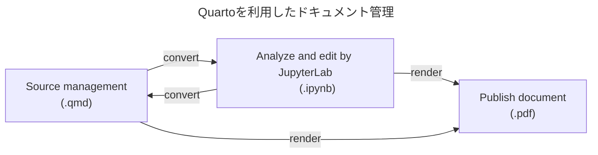

# 開発コンテナ(Development Containers)の利用

このリポジトリでは [開発コンテナ(Dev Container)](https://containers.dev/)をサポートしています。
これを使うと、ローカルの環境を汚すことなく、RedAmberに必要なツール一式を含んだ環境を準備することができます。この環境には、Ruby、Apache Arrow、RedAmberのソースツリー、GitHub CI、サンプルデータセット、IRubyカーネルを含んだJupyter Labなどが含まれていて、簡単でメンテナンスしやすく、かつ再利用性が高い構成になっています。

RedAmber用のDev Containerは、`.devcontainer` ディレクトリに必要な設定が書かれています。現在の実装では、Dockerfileを使用せず、Dev Containers用のUbuntuベースイメージに、Dev Container Featuresを使って、Python、GitHub CIの環境を加えて作っています。Ruby は Container ができてから走らせるスクリプトでインストールしています。

Dockerfileで作るのと比べて、
- User周りの設定を自動的にやってくれる
- 言語環境をFeatureとして個別に追加することができる
  - PythonではJupyter Labをオプションとして追加できる
  - Rubyは`rbenv`をインストールしてあって後から別のバージョンを追加できる
  - Quartoを動かせる環境を簡単に追加でき、Jupyter notebookのソース管理に利用できる

等の利点があります。

ここでは代表的な利用法を2つ紹介します。

## 1. GitHub Codespacesでクラウド上のVMをブラウザから使う

### 必要なもの
GitHubアカウントにサインインしている必要があります。

### 注意
以下の手順では、Codespacesを起動するあなたのアカウントのクォータを消費します。GitHub Freeに対しては120時間/月・コア(2コアでは60時間)、ストレージ15GB/月が無料で使用できます。使用状況については [Billing and plans](https://github.com/settings/billing)のCodespacesの項を参照してください。

### 手順
- GitHubの[RedAmberのリポジトリ](https://github.com/red-data-tools/red_amber)を開いてください。
  - 開発を行う場合は、フォークしてご自身のリポジトリを作り、それを開いてください。

- リポジトリ内の「<>Code」ボタン、「Codespaces」タブにある、「Create codespace on main」ボタンを押して新しいCodespacesを作成してください。
  * 既にCodespacesがある場合は、該当するコンテナ名をクリックすると再接続できます。
- Codespacesの作成には時間がかかります。「View log」をクリックしてぼーっとログを眺めるか、コーヒーを淹れに行くとよいでしょう。
  * 今後、GitHub Container Registoryにキャッシュを保存して、速く起動できるようにする予定です。
- VS Code for ブラウザでリポジトリが開きます。

  動作の確認は、下の[動作の確認](#動作の確認)を参照してください。

### 詳細
より詳しくは、[(GitHub Docs)リポジトリの codespace を作成する](https://docs.github.com/ja/codespaces/developing-in-codespaces/creating-a-codespace-for-a-repository)を参照してください。

## 2. ローカルにクローンしたリポジトリ―からDev Containerを立ち上げ、VS Codeで使う

### 必要なもの
- Visual Studio Code (October 2020 Release 1.51以降)

  GitHub Codespaces 拡張機能をインストールして、GitHub 資格情報を使用してサインインする必要があります。[GitHub Docs - GitHub Codespaces - 前提条件](https://docs.github.com/ja/codespaces/developing-in-codespaces/using-github-codespaces-in-visual-studio-code#prerequisites)を参照して設定を済ませておいてください。

- Docker
  - Windows

    Windows 10 Pro/Enterprise では Docker Desktop 2.0 以降。
    Windows 10 Home (2004+) では、Docker Desktop 2.3 以降と WSL 2 バックエンド。

  - Mac

    Docker Desktop 2.0 以降

  - Linux

    Docker CE/EE 18.06 以降と Docker Compose 1.21 以降

- Git

### 手順

- ローカルに RedAmberリポジトリのクローンを作成します。

  - 開発を行う場合は、フォークしてご自身のリポジトリを作り、それをクローンしてください。

  ```
  $ git clone https://github.com/red-data-toolsまたは貴方のアカウント名/red_amber.git
  ```
  または、GitHub CLIで、
  ```
  $ gh repo clone red-data-toolsまたは貴方のアカウント名/red_amber
  ```
  とします。

- 作成したローカルのリポジトリフォルダーをVS Codeで開きます。
  ```
  $ code red_amber
  ```

- コンテナーで開く

  今のフォルダーをコンテナーで再度開きます。

  - 左下隅のステータスバーのリモートホスト表示（今はローカルなので「><」の後ろに何もついていない）をクリックするとリモートウィンドウを開くオプションが表示されるので、「コンテナーで再度開く」を選択します。

- コンテナーの構築が開始されます

  最初の構築には、数分かかることがあります。それ以降の構築は高速になります。
  構築が完了すると、左下隅のステータスバーのリモートホスト表示にコンテナー名が表示されます。

## 動作の確認

### ターミナルでインストールされているツールを確認する

  ターミナルが開いていない場合は、 ``CTRL + ` `` で開いてください。

  下記のコマンドを実行して、ツールがインストール済みであることを確かめてください。

  ```shell
  $ ruby -v --jit
  $ rbenv versions
  $ gem -v
  $ gem list
  $ bundler -v
  $ iruby -v

  $ python --version
  $ pip --version
  $ pip list
  $ pipenv --version
  $ jupyter --version
  $ jupyter kenelspec list

  $ git -v
  $ git config user.name
  $ gh --version
  ```

  ユーザーは、`vscode` という名前で、`uid/gid` はローカルのユーザーと同じになっています。

   ```shell
   $ id
   ```

### RedAmberのテストを走らせてみる

  ```shell
  $ bundle exec rake
  ```

### REPLでRedAmberを試す

  プリロードされたデータセットを使って、irbの環境でRedAmberの動作を確認できます。初回はRed Datasetsのデータをロードするため少し時間がかかります。

  ```ruby
  $ rake example

  (snip)

      81: # Welcome to RedAmber example!
      82: # This environment will offer these pre-loaded datasets:
      83: #   penguins, diamonds, iris, starwars, simpsons_paradox_covid,
      84: #   mtcars, band_members, band_instruments, band_instruments2
      85: #   import_cars, comecome, rubykaigi, dataframe, subframes
   => 86: binding.irb

  irb(main):001:0>
  ```

  irbの動作を途中で止めているので、ここで表示されているデータセットが変数に読み込まれています。

  ```ruby
  irb(main):001:0> import_cars
  =>
  #<RedAmber::DataFrame : 5 x 6 Vectors, 0x0000000000010914>
       Year    Audi     BMW BMW_MINI Mercedes-Benz      VW
    <int64> <int64> <int64>  <int64>       <int64> <int64>
  0    2017   28336   52527    25427         68221   49040
  1    2018   26473   50982    25984         67554   51961
  2    2019   24222   46814    23813         66553   46794
  3    2020   22304   35712    20196         57041   36576
  4    2021   22535   35905    18211         51722   35215
  ```

  名前空間の`RedAmber` はインクルードされています。
  ```ruby
  irb(main):002:0> VERSION
  => "0.5.0"
  irb(main):003:0> Arrow::VERSION
  => "12.0.1"
  ```

  `@`を入力すると最初のブレークポイントに戻ることができます。

  `exit` を入力するとirbを抜けます。

### Jupyter LabでRedAmberを試す

  Python と IRuby カーネルを持ったJupyter Labをブラウザで起動することができます。

  ```shell
  $ rake jupyter
  ```

  で、ローカルの8888ポートでブラウザが立ち上がります。

  - Notebookフォルダーとして、`doc/notebook` が割り当てられていて、そこには2つの`.ipynb`ファイルがあります。
    - `red_amber.ipynb` : `README.md` で紹介している操作例。
    - `examples_of_red_amber.ipynb` : 様々な例を集めたもの。
  - `require 'red_amber'` は `lib` 以下のソースを読み込んでいます。

## Quarto によるドキュメント操作

[Quarto](https://quarto.org/)はオープンソースの科学技術ドキュメントの出版システムです。

この環境では、RedAmber の動作例を活用するために Quarto CLI を使っています。



* Quartoのドキュメント `qmd` 形式でソース管理できます。
* `.qmd`ファイルを Jupyter notebook ファイル(`.ipynb`)に変換して、
  Jupyter Lab上で編集したりデータ解析ができます。
* `pdf`形式 に変換することができます。

### Quarto の動作を確認する

Quarto のバージョンと動作環境をチェックするには次のようにします。

```shell
$ quarto -v
$ quarto check
```

ヘルプを表示するには下記のようにします。

```shell
$ quarto --help
$ quarto render --help
```

### ソースからJupyter Notebookを生成する
`.qmd`ソースファイルから `.ipynb` を生成するには、

```shell
$ bundle exec rake quarto:convert
```
とします。`doc/qmd`フォルダー以下にあるqmdソースファイルから `doc/notebook`フォルダーに`ipynb`ノートブックファイルが作成されます。

より一般的には、

```shell
$ quarto convert ソースファイル.qmd
$ quarto convert ソースファイル.qmd --output 出力先ノートブック.ipynb
```
上の書き方では、出力ファイルはソースファイルの拡張子を `.ipynb`に変えて、ソースファイルと同じディレクトリに保存されます。

下記のコマンドは、Notebookを作成後、Jupyter Labを開きます。

```shell
$ bundle exec rake jupyter
```

### Jupyter Notebookファイルを`qmd`形式で保存する

編集したJupyter Notebookをqmd形式に変換できます。

```shell
$ quarto convert ノートブック.ipynb
$ quarto convert ノートブック.ipynb --output 出力先ソースファイル.qmd
```

### その他の活用方法

下記のコマンドは`doc/qmd`フォルダー以下にあるqmdソースファイルを`ipynb`に変換し、実行してpdfを作成します。

```shell
$ bundle exec rake quarto:test
```

下記は`doc/notebook`フォルダーを含めたrakeの生成物を消去します。

```shell
$ rake clean
```

Quartoについてより詳しくは、コマンドラインヘルプ(`quarto --help`)、または[Quarto](https://quarto.org/)公式ページをご覧ください。

### 謝辞

Quarto の利用は、西田孝三さんの2022年度のRubyアソシエーション開発助成事業プロジェクト『RubyDataエコシステムへのQuartoの導入とその利用の促進のためのコミュニティ活動』 がきっかけとなりました。この場をお借りして感謝申し上げます。
