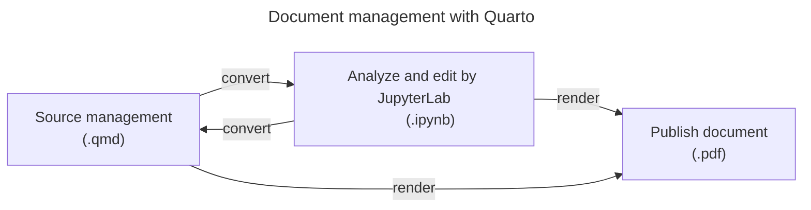

# How to use Development Containers in RedAmber

We support [Development Container](https://containers.dev/) in this repository.
You can prepare a container as a full-featured development environment for RedAmber. Dev Containers allow you to encapsulate Ruby, Apache Arrow, RedAmber with source tree, GitHub CLI, sample datasets and Jupyter Lab with IRuby kernel. You don't need to worry about the change of your local environment.

`.devcontainer` directory in this repository includes settings of Dev Container for RedAmber. We don't use Dockerfile here, based on Ubuntu image for Dev Container, Python and GitHub CLI tools using Dev Container Features. I think this style has simplicity, maintainability, and reusability. Ruby is added after the container is created by script.

It has some benefits below compared to make dev environment by Dockerfile;

1) It automatically makes user setting with same UID/GID as local user.
2) Additional tools can be introduced by `Dev Container Features`.
3) Ruby Feature includes `rbenv` and it is easy to add another version afterwards.
4) Python Feature includes Jupyter Lab as an option.
5) Quarto is introduced. It converts Jupyter notebook from/to qmd file and it is useful to manage notebook in the source tree.

We will show 2 examples here.

## 1. GitHub Codespace in cloud from browser

### Prerequisite

You need to sign in GitHub Account.

### Notice

You will consume your Codespace quota of your account in the step below. For GitHub Free, you can use 120 hours per month per core (it means 60 hours per month for 2 cores VM) and have a storage with 15 GB per month for free. You can check your usage from `Codespaces` section in [Billing and plans](https://github.com/settings/billing).

### Procedures
- Open the [repository of RedAmber](https://github.com/red-data-tools/red_amber) in GitHub.
  - If you are going to develop RedAmber, you should fork it and open your forked repository to push PR later.

- Push `<>Code` button, select `Codespaces` tab, push `Create codespace on main` button to create new Codespace.
  * You can re-connect existing Codespace if you already have there.
- Creating Codespace takes time. You can click `View log` to browse log running or have a coffee to wait.
  * I am planning to improve building process to save cache in GitHub Container Registory.

- VS Code for browser will open the repository in the remote container.

  Please refer [Operations](#operations) to use the environment.

### Details
Please see [(GitHub Docs)Creating a codespace for a repository](https://docs.github.com/en/codespaces/developing-in-codespaces/creating-a-codespace-for-a-repository) for detail.

## 2. Start Dev Container from the local repository, and use it from VS Code

### Prerequisites
- Visual Studio Code (October 2020 Release 1.51+)

  You need to install GitHub Codespaces extention, and sign into GitHub Codespaces  with your GitHub credentials. Please see [GitHub Docs - GitHub Codespaces - Prerequisites](https://docs.github.com/en/codespaces/developing-in-codespaces/using-github-codespaces-in-visual-studio-code#prerequisites) and prepare settings.

- Docker
  - Windows

    In Windows 10 Pro/Enterprise, Docker Desktop 2.0+
    In Windows 10 Home (2004+), Docker Desktop 2.3+ and WSL 2 backend.

  - Mac

    Docker Desktop 2.0+

  - Linux

    Docker CE/EE 18.06+ and Docker Compose 1.21+

- Git

### Procedures

- Create a local clone of RedAmber repository.

  - If you are going to develop RedAmber, make a fork and clone it.

  ```
  $ git clone https://github.com/(red-data-tools or your account name)/red_amber.git
  ```

  Alternatively using GitHub CLI,

  ```
  $ gh repo clone (red-data-tools or your account name)/red_amber
  ```

- Open local repo folder by VS Code.

  ```
  $ code red_amber
  ```

- Re-open by container

  Re-open current folder by container.

  - Click remote host indicator in the left bottom corner, then options to open remote windows will open. Choose 'reopen by container'.

- Building of container will start.

  It takes time for first building. If it is finished, container name will be displayed on the remote host indicator.

## Operations

### Check installed tools by terminal

  If you don't have the terminal open, open it with ``CTRL + ` ``.

  Run these command to check these tools are installed.

  ```shell
  $ ruby -v --jit
  $ rbenv versions
  $ gem -v
  $ gem list
  $ bundler -v
  $ iruby -v

  $ python --version
  $ pip --version
  $ pip list
  $ pipenv --version
  $ jupyter --version
  $ jupyter kenelspec list

  $ git -v
  $ git config user.name
  $ gh --version
  ```

  The user name is `vscode` in this environment. `uid` and `gid` are the same as local user.

  ```shell
  $ id
  ```

### Run tests of RedAmber

  ```shell
  $ bundle exec rake
  ```

### Try RedAmber in REPL

  You can try RedAmber in `irb` using pre loaded datasets. It takes time in the first run to load the datasets from Red Datasets.

  ```ruby
  $ rake example

  (snip)

      81: # Welcome to RedAmber example!
      82: # This environment will offer these pre-loaded datasets:
      83: #   penguins, diamonds, iris, starwars, simpsons_paradox_covid,
      84: #   mtcars, band_members, band_instruments, band_instruments2
      85: #   import_cars, comecome, rubykaigi, dataframe, subframes
   => 86: binding.irb

  irb(main):001:0>
  ```

  This code stops in the code by `binding.irb`, you have some datasets in local variables.

  ```ruby
  irb(main):001:0> import_cars
  =>
  #<RedAmber::DataFrame : 5 x 6 Vectors, 0x0000000000010914>
       Year    Audi     BMW BMW_MINI Mercedes-Benz      VW
    <int64> <int64> <int64>  <int64>       <int64> <int64>
  0    2017   28336   52527    25427         68221   49040
  1    2018   26473   50982    25984         67554   51961
  2    2019   24222   46814    23813         66553   46794
  3    2020   22304   35712    20196         57041   36576
  4    2021   22535   35905    18211         51722   35215
  ```

  The namespace `RedAmber` is included.

  ```ruby
  irb(main):002:0> VERSION
  => "0.5.0"
  irb(main):003:0> Arrow::VERSION
  => "12.0.1"
  ```

  You can return to the first breakinng point by hitting `@`.

  You can exit irb by `exit`.

### Try RedAmber in Jupyter Lab

  You can try Jupyter Lab with Python and IRuby kernels in your browser.

  ```shell
  $ rake jupyter
  ```

  - `doc/notebook` is allocated as notebook folder. There are 2 files in it.
    - `red_amber.ipynb` : Examples in `README.md`.
    - `examples_of_red_amber.ipynb` : Hundreds examples of RedAmber.
  - `require 'red_amber'` will load from source directory `lib`.

## Document authoring by Quarto

[Quarto](https://quarto.org/) is an open-source scientific and technical publishing system.
We use Quarto CLI to show usage examples of RedAmber.



* We can manage the source of the Jupyter notebook by Quarto's markdown format `qmd`.
* We can convert a `.qmd` file to a Jupyter notebook file (`.ipynb`) and will be able to edit it or make analysis on Jupyter Lab.
* We can render `.qmd` or `.ipynb` files to `.pdf`.

### To show the information of Quarto

Try below to show version and verify correct functioning of Quarto installation.

```shell
$ quarto -v
$ quarto check
```

To show help,

```shell
$ quarto --help
$ quarto render --help
```

### Convert qmd file to Jupyter Notebook

To convert `.qmd` source file to `.ipynb`,

```shell
$ bundle exec rake quarto:convert
```

This command will create `ipynb` notebooks from `doc/qmd` and save them to `doc/notebook`.

In more general,

```shell
$ quarto convert source_file.qmd
$ quarto convert source_file.qmd --output Notebook.ipynb
```

The first one will output `source_file.ipynb` file in the same directory.

Command below will convert qmd_document files in `doc/qmd` to `.ipynb` files and save them to `doc/notebook` . Then open `doc/notebook` with Jupyter Lab.

```shell
$ bin/jupyter
```

### Convert Jupyter Notebook to `qmd`

You can convert Notebook file to qmd file.

```shell
$ quarto convert notebook.ipynb
$ quarto convert notebook.ipynb --output output_source_file.qmd
```

### Others

To render Notebook files in `doc/qmd` to pdf,

```shell
$ bundle exec rake quarto:test
```
To clear `doc/notebook` (and all the generated artifacts by rake),

```shell
$ rake clean
```

To know more about Quarto, see command line help by `quarto --help`, or visit [Quarto](https://quarto.org/) web.

### Thanks

 As for the use of Quarto, I started to try after the Kozo Nishida's work with Ruby Association Grant 2022 "Introducing Quarto into the RubyData ecosystem and promoting the combination to the Ruby community". I would like to take this opportunity to thank him.
