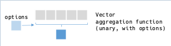
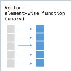
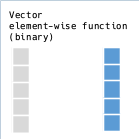

# Vector

Class `RedAmber::Vector` represents a series of data in the DataFrame.

## Constructor

### Create from a column in a DataFrame
  
  ```ruby
  df = DataFrame.new(x: [1, 2, 3])
  df[:x]
  # =>
  #<RedAmber::Vector(:uint8, size=3):0x000000000000f4ec>
  [1, 2, 3]
  ```

### New from an Array

  ```ruby
  vector = Vector.new([1, 2, 3])
  # or
  vector = Vector.new(1, 2, 3)
  # or
  vector = Vector.new(1..3)
  # or
  vector = Vector.new(Arrow::Array.new([1, 2, 3])
  # or
  require 'arrow-numo-narray'
  vector = Vector.new(Numo::Int8[1, 2, 3])

  # =>
  #<RedAmber::Vector(:uint8, size=3):0x000000000000f514>
  [1, 2, 3]
  ```

## Properties

### `to_s`

### `values`, `to_a`, `entries`

### `indices`, `indexes`, `indeces`

  Return indices in an Array.

### `to_ary`

  It implicitly converts a Vector to an Array when required.

  ```ruby
  [1, 2] + Vector.new([3, 4])

  # =>
  [1, 2, 3, 4]
  ```

### `size`, `length`, `n_rows`, `nrow`

### `empty?`

### `type`

### `boolean?`, `numeric?`, `string?`, `temporal?`

### `type_class`

### `each`, `map`, `collect`

  If block is not given, returns Enumerator.

### `n_nils`, `n_nans`

  - `n_nulls` is an alias of `n_nils`

### `has_nil?`

  Returns `true` if self has any `nil`. Otherwise returns `false`.

### `inspect(limit: 80)`

  - `limit` sets size limit to display a long array.

    ```ruby
    vector = Vector.new((1..50).to_a)
    # =>
    #<RedAmber::Vector(:uint8, size=50):0x000000000000f528>
    [1, 2, 3, 4, 5, 6, 7, 8, 9, 10, 11, 12, 13, 14, 15, 16, 17, 18, 19, 20, 21, 22, ... ]
    ```

## Selecting Values

### `take(indices)`, `[](indices)`

- Acceptable class for indices:
  - Integer, Float
  - Vector of integer or float
  - Arrow::Arry of integer or float
- Negative index is also OK like the Ruby's primitive Array.

```ruby
array = Vector.new(%w[A B C D E])
indices = Vector.new([0.1, -0.5, -5.1])
array.take(indices)
# or
array[indices]

# =>
#<RedAmber::Vector(:string, size=3):0x000000000000f820>
["A", "E", "A"]
```

### `filter(booleans)`, `select(booleans)`, `[](booleans)`

- Acceptable class for booleans:
  - An array of true, false, or nil
  - Boolean Vector
  - Arrow::BooleanArray

```ruby
array = Vector.new(%w[A B C D E])
booleans = [true, false, nil, false, true]
array.filter(booleans)
# or
array[booleans]

# =>
#<RedAmber::Vector(:string, size=2):0x000000000000f21c>
["A", "E"]
```
`filter` and `select` also accepts a block.

## Functions

### Unary aggregations: `vector.func => scalar`

  

| Method    |Boolean|Numeric|String|Options|Remarks|
| ----------- | --- | --- | --- | --- | --- |
| ✓ `all?`     |  ✓  |     |     | ✓ ScalarAggregate| alias `all` |
| ✓ `any?`     |  ✓  |     |     | ✓ ScalarAggregate| alias `any` |
| ✓ `approximate_median`|  |✓|  | ✓ ScalarAggregate| alias `median`|
| ✓ `count`   |  ✓  |  ✓  |  ✓  | ✓  Count  |     |
| ✓ `count_distinct`| ✓ | ✓ | ✓ | ✓  Count  |alias `count_uniq`|
|[ ]`index`   | [ ] | [ ] | [ ] |[ ] Index  |     |
| ✓ `max`     |  ✓  |  ✓  |  ✓  | ✓ ScalarAggregate|     |
| ✓ `mean`    |  ✓  |  ✓  |     | ✓ ScalarAggregate|     |
| ✓ `min`     |  ✓  |  ✓  |  ✓  | ✓ ScalarAggregate|     |
| ✓ `min_max` |  ✓  |  ✓  |  ✓  | ✓ ScalarAggregate|     |
|[ ]`mode`    |     | [ ] |     |[ ] Mode    |     |
| ✓ `product` |  ✓  |  ✓  |     | ✓ ScalarAggregate|     |
| ✓ `quantile`|     |  ✓  |     | ✓ Quantile|Specify probability in (0..1) by a parameter (default=0.5)|
| ✓ `sd    `  |     |  ✓  |     |          |ddof: 1 at `stddev`|
| ✓ `stddev`  |     |  ✓  |     | ✓ Variance|ddof: 0 by default|
| ✓ `sum`     |  ✓  |  ✓  |     | ✓ ScalarAggregate|     |
|[ ]`tdigest` |     | [ ] |     |[ ] TDigest |     |
| ✓ `var    `|     |  ✓  |     |   |ddof: 1 at `variance`<br>alias `unbiased_variance`|
| ✓ `variance`|     |  ✓  |     | ✓ Variance|ddof: 0 by default|


Options can be used as follows.
See the [document of C++ function](https://arrow.apache.org/docs/cpp/compute.html) for detail.

```ruby
double = Vector.new([1, 0/0.0, -1/0.0, 1/0.0, nil, ""])
#=>
#<RedAmber::Vector(:double, size=6):0x000000000000f910>
[1.0, NaN, -Infinity, Infinity, nil, 0.0]

double.count #=> 5
double.count(mode: :only_valid) #=> 5, default
double.count(mode: :only_null) #=> 1
double.count(mode: :all) #=> 6

boolean = Vector.new([true, true, nil])
#=>
#<RedAmber::Vector(:boolean, size=3):0x000000000000f924>
[true, true, nil]

boolean.all #=> true
boolean.all(skip_nulls: true) #=> true
boolean.all(skip_nulls: false) #=> false
```

### Check if `function` is an aggregation function: `Vector.aggregate?(function)`

Return true if `function` is an unary aggregation function. Otherwise return false.

### Treat aggregation function as an element-wise function: `propagate(function)`

Spread the return value of an aggregate function as if it is a element-wise function.

```ruby
vec = Vector.new(1, 2, 3, 4)
vec.propagate(:mean)
# =>
#<RedAmber::Vector(:double, size=4):0x000000000001985c>
[2.5, 2.5, 2.5, 2.5]
```

`#propagate` also accepts a block to compute with a customized aggregation function yielding a scalar.

```ruby
vec.propagate { |v| v.mean.round }
# =>
#<RedAmber::Vector(:uint8, size=4):0x000000000000cb98>                     
[3, 3, 3, 3]
```

### Unary element-wise: `vector.func => vector`

  

| Method    |Boolean|Numeric|String|Options|Remarks|
| ------------ | --- | --- | --- | --- | ----- |
| ✓ `-@`       |     |  ✓  |     |     |as `-vector`|
| ✓ `negate`   |     |  ✓  |     |     |`-@`   |
| ✓ `abs`      |     |  ✓  |     |     |       |
| ✓ `acos`     |     |  ✓  |     |     |       |
| ✓ `asin`     |     |  ✓  |     |     |       |
| ✓ `atan`     |     |  ✓  |     |     |       |
| ✓ `bit_wise_not`|  | (✓) |     |     |integer only|
| ✓ `ceil`     |     |  ✓  |     |     |       |
| ✓ `cos`      |     |  ✓  |     |     |       |
| ✓`fill_nil_backward`| ✓ | ✓ | ✓ |    |       |
| ✓`fill_nil_forward` | ✓ | ✓ | ✓ |    |       |
| ✓ `floor`    |     |  ✓  |     |     |       |
| ✓ `invert`   |  ✓  |     |     |     |`!`, alias `not`|
| ✓ `ln`       |     |  ✓  |     |     |       |
| ✓ `log10`    |     |  ✓  |     |     |       |
| ✓ `log1p`    |     |  ✓  |     |     |Compute natural log of (1+x)|
| ✓ `log2`     |     |  ✓  |     |     |       |
| ✓ `round`    |     |  ✓  |     | ✓ Round (:mode, :n_digits)|    |
| ✓ `round_to_multiple`| | ✓ |   | ✓ RoundToMultiple :mode, :multiple| multiple must be an Arrow::Scalar|
| ✓ `sign`     |     |  ✓  |     |     |       |
| ✓ `sin`      |     |  ✓  |     |     |       |
| ✓`sort_indexes`| ✓  | ✓  | ✓  |:order|alias `sort_indices`|
| ✓ `tan`      |     |  ✓  |     |     |       |
| ✓ `trunc`    |     |  ✓  |     |     |       |

Examples of options for `#round`;

- `:n-digits` The number of digits to show.
- `round_mode` Specify rounding mode.

```ruby
double = Vector.new([15.15, 2.5, 3.5, -4.5, -5.5])
# => [15.15, 2.5, 3.5, -4.5, -5.5]
double.round
# => [15.0, 2.0, 4.0, -4.0, -6.0]
double.round(mode: :half_to_even)
# => Default. Same as double.round
double.round(mode: :towards_infinity)
# => [16.0, 3.0, 4.0, -5.0, -6.0]
double.round(mode: :half_up)
# => [15.0, 3.0, 4.0, -4.0, -5.0]
double.round(mode: :half_towards_zero)
# => [15.0, 2.0, 3.0, -4.0, -5.0]
double.round(mode: :half_towards_infinity)
# => [15.0, 3.0, 4.0, -5.0, -6.0]
double.round(mode: :half_to_odd)
# => [15.0, 3.0, 3.0, -5.0, -5.0]

double.round(n_digits: 0)
# => Default. Same as double.round
double.round(n_digits: 1)
# => [15.2, 2.5, 3.5, -4.5, -5.5]
double.round(n_digits: -1)
# => [20.0, 0.0, 0.0, -0.0, -10.0]
```

### Binary element-wise: `vector.func(vector) => vector`

  

| Method       |Boolean|Numeric|String|Options|Remarks|
| ----------------- | --- | --- | --- | --- | ----- |
| ✓ `add`           |     |  ✓  |     |     | `+`   |
| ✓ `atan2`         |     |  ✓  |     |     |       |
| ✓ `and_kleene`    |  ✓  |     |     |     | `&`   |
| ✓ `and_org   `    |  ✓  |     |     |     |`and` in Red Arrow|
| ✓ `and_not`       |  ✓  |     |     |     |       |
| ✓ `and_not_kleene`|  ✓  |     |     |     |       |
| ✓ `bit_wise_and`  |     | (✓) |     |     |integer only|
| ✓ `bit_wise_or`   |     | (✓) |     |     |integer only|
| ✓ `bit_wise_xor`  |     | (✓) |     |     |integer only|
| ✓ `divide`        |     |  ✓  |     |     | `/`   |
| ✓ `equal`         |  ✓  |  ✓  |  ✓  |     |`==`, alias `eq`|
| ✓ `greater`       |  ✓  |  ✓  |  ✓  |     |`>`, alias `gt`|
| ✓ `greater_equal` |  ✓  |  ✓  |  ✓  |     |`>=`, alias `ge`|
| ✓ `is_finite`     |     |  ✓  |     |     |       |
| ✓ `is_inf`        |     |  ✓  |     |     |       |
| ✓ `is_na`         |  ✓  |  ✓  |  ✓  |     |       |
| ✓ `is_nan`        |     |  ✓  |     |     |       |
|[ ]`is_nil`        |  ✓  |  ✓  |  ✓  |[ ] Null|alias `is_null`|
| ✓ `is_valid`      |  ✓  |  ✓  |  ✓  |     |       |
| ✓ `less`          |  ✓  |  ✓  |  ✓  |     |`<`, alias `lt`|
| ✓ `less_equal`    |  ✓  |  ✓  |  ✓  |     |`<=`, alias `le`|
| ✓ `logb`          |     |  ✓  |     |     |logb(b) Compute base `b` logarithm|
|[ ]`mod`           |     | [ ] |     |     | `%`   |
| ✓ `multiply`      |     |  ✓  |     |     | `*`   |
| ✓ `not_equal`     |  ✓  |  ✓  |  ✓  |     |`!=`, alias `ne`|
| ✓ `or_kleene`     |  ✓  |     |     |     | `\|`  |
| ✓ `or_org`        |  ✓  |     |     |     |`or` in Red Arrow|
| ✓ `power`         |     |  ✓  |     |     | `**`  |
| ✓ `subtract`      |     |  ✓  |     |     | `-`   |
| ✓ `shift_left`    |     | (✓) |     |     |`<<`, integer only|
| ✓ `shift_right`   |     | (✓) |     |     |`>>`, integer only|
| ✓ `xor`           |  ✓  |     |     |     | `^`   |

### `uniq`

  Returns a new array with distinct elements.

### `tally` and `value_counts`

  Compute counts of unique elements and return a Hash.

  It returns almost same result as Ruby's tally. These methods consider NaNs are same.

  ```ruby
  array = [0.0/0, Float::NAN]
  array.tally #=> {NaN=>1, NaN=>1}

  vector = Vector.new(array)
  vector.tally #=> {NaN=>2}
  vector.value_counts #=> {NaN=>2}
  ```
### `index(element)`

  Returns index of specified element.

### `quantiles(probs = [0.0, 0.25, 0.5, 0.75, 1.0], interpolation: :linear, skip_nils: true, min_count: 0)`

  Returns quantiles for specified probabilities in a DataFrame.

### `sort_indexes`, `sort_indices`, `array_sort_indices`

## Coerce

```ruby
vector = Vector.new(1,2,3)
# => 
#<RedAmber::Vector(:uint8, size=3):0x00000000000decc4>            
[1, 2, 3]                                                         

# Vector's `#*` method
vector * -1
# =>
#<RedAmber::Vector(:int16, size=3):0x00000000000e3698>            
[-1, -2, -3]                                                      

# coerced calculation
-1 * vector
# => 
#<RedAmber::Vector(:int16, size=3):0x00000000000ea4ac>            
[-1, -2, -3]

# `@-` operator
-vector
# =>
#<RedAmber::Vector(:uint8, size=3):0x00000000000ee7b4>
[255, 254, 253]
```

## Update vector's value
### `replace(specifier, replacer)` => vector

- Accepts Scalar, Range  of Integer, Vector, Array, Arrow::Array as a specifier
- Accepts Scalar, Vector, Array and Arrow::Array as a replacer.
- Boolean specifiers specify the position of replacer in true.
  - If booleans.any is false, no replacement happen and return self.
- Index specifiers specify the position of replacer in indices.
- replacer specifies the values to be replaced.
  - The number of true in booleans must be equal to the length of replacer

```ruby
vector = Vector.new([1, 2, 3])
booleans = [true, false, true]
replacer = [4, 5]
vector.replace(booleans, replacer)
# => 
#<RedAmber::Vector(:uint8, size=3):0x000000000001ee10>
[4, 2, 5] 
```

- Scalar value in replacer can be broadcasted.

```ruby
replacer = 0
vector.replace(booleans, replacer)
# => 
#<RedAmber::Vector(:uint8, size=3):0x000000000001ee10>
[0, 2, 0] 
```

- Returned data type is automatically up-casted by replacer.

```ruby
replacer = 1.0
vector.replace(booleans, replacer)
# => 
#<RedAmber::Vector(:double, size=3):0x0000000000025d78>
[1.0, 2.0, 1.0]
```

- Position of nil in booleans is replaced with nil.

```ruby
booleans = [true, false, nil]
replacer = -1
vector.replace(booleans, replacer)
=> 
#<RedAmber::Vector(:int8, size=3):0x00000000000304d0>
[-1, 2, nil]
```

- replacer can have nil in it.

```ruby
booleans = [true, false, true]
replacer = [nil]
vector.replace(booleans, replacer)
=> 
#<RedAmber::Vector(:int8, size=3):0x00000000000304d0>
[nil, 2, nil]
```

- An example to replace 'NA' to nil.

```ruby
vector = Vector.new(['A', 'B', 'NA'])
vector.replace(vector == 'NA', nil)
# =>
#<RedAmber::Vector(:string, size=3):0x000000000000f8ac>
["A", "B", nil]
```

- Specifier in indices.

Specified indices are used 'as sorted'. Position in indices and replacer may not have correspondence.

```ruby
vector = Vector.new([1, 2, 3])
indices = [2, 1]
replacer = [4, 5]
vector.replace(indices, replacer)
# =>
#<RedAmber::Vector(:uint8, size=3):0x000000000000f244>
[1, 4, 5] # not [1, 5, 4]
```


### `fill_nil_forward`, `fill_nil_backward` => vector

Propagate the last valid observation forward (or backward).
Or preserve nil if all previous values are nil or at the end.

```ruby
integer = Vector.new([0, 1, nil, 3, nil])
integer.fill_nil_forward
# =>
#<RedAmber::Vector(:uint8, size=5):0x000000000000f960>
[0, 1, 1, 3, 3]

integer.fill_nil_backward
# =>
#<RedAmber::Vector(:uint8, size=5):0x000000000000f974>
[0, 1, 3, 3, nil]
```

### `boolean_vector.if_else(true_choice, false_choice)` => vector

Choose values based on self. Self must be a boolean Vector.

`true_choice`, `false_choice` must be of the same type scalar / array / Vector.
`nil` values in `cond` will be promoted to the output.

This example will normalize negative indices to positive ones.

```ruby
indices = Vector.new([1, -1, 3, -4])
array_size = 10
normalized_indices = (indices < 0).if_else(indices + array_size, indices)

# =>
#<RedAmber::Vector(:int16, size=4):0x000000000000f85c>
[1, 9, 3, 6]
```

### `is_in(values)` => boolean vector

For each element in self, return true if it is found in given `values`, false otherwise.
By default, nulls are matched against the value set. (This will be changed in SetLookupOptions: not impremented.)

```ruby
vector = Vector.new %W[A B C D]
values = ['A', 'C', 'X']
vector.is_in(values)

# =>
#<RedAmber::Vector(:boolean, size=4):0x000000000000f2a8>
[true, false, true, false]
```

`values` are casted to the same Class of Vector.

```ruby
vector = Vector.new([1, 2, 255])
vector.is_in(1, -1)

# =>
#<RedAmber::Vector(:boolean, size=3):0x000000000000f320>
[true, false, true]
```

### `shift(amount = 1, fill: nil)`

Shift vector's values by specified `amount`. Shifted space is filled by value `fill`.

```ruby
vector = Vector.new([1, 2, 3, 4, 5])
vector.shift

# =>
#<RedAmber::Vector(:uint8, size=5):0x00000000000072d8>  
[nil, 1, 2, 3, 4]

vector.shift(-2)

# =>
#<RedAmber::Vector(:uint8, size=5):0x0000000000009970>  
[3, 4, 5, nil, nil]

vector.shift(fill: Float::NAN)

# =>
#<RedAmber::Vector(:double, size=5):0x0000000000011d3c>                    
[NaN, 1.0, 2.0, 3.0, 4.0]
```

### `split_to_columns(sep = ' ', limit = 0)`

Split string type Vector with any ASCII whitespace as separator.
Returns an Array of Vectors.

```ruby
vector = Vector.new(['a b', 'c d', 'e f'])
vector.split_to_columns

#=> 
[#<RedAmber::Vector(:string, size=3):0x00000000000363a8>                                
["a", "c", "e"]                                    
,                                                  
 #<RedAmber::Vector(:string, size=3):0x00000000000363bc>
["b", "d", "f"]                                    
]
```
It will be used for column splitting in DataFrame.

```ruby
df = DataFrame.new(year_month: %w[2022-01 2022-02 2022-03])
  .assign(:year, :month) { year_month.split_to_columns('-') }
  .drop(:year_month)

#=>
#<RedAmber::DataFrame : 3 x 2 Vectors, 0x000000000000f974>
  year     month
  <string> <string>
0 2022     01
1 2022     02
2 2022     03
```

### `split_to_rows(sep = ' ', limit = 0)`

Split string type Vector with any ASCII whitespace as separator.
Returns an flattend into rows by Vector.

```ruby
vector = Vector.new(['a b', 'c d', 'e f'])
vector.split_to_rows

#=>
#<RedAmber::Vector(:string, size=6):0x000000000002ccf4>
["a", "b", "c", "d", "e", "f"]
```

### `merge(other, sep: ' ')`

Merge String or other string Vector to self using aseparator.
Self must be a string Vector.
Returns merged string Vector.

```ruby
# with vector
vector = Vector.new(%w[a c e])
other = Vector.new(%w[b d f])
vector.merge(other)

#=>
#<RedAmber::Vector(:string, size=3):0x0000000000038b80>
["a b", "c d", "e f"]
```

If other is a String it will be broadcasted.

```ruby
# with vector
vector = Vector.new(%w[a c e])

#=>
#<RedAmber::Vector(:string, size=3):0x00000000000446b0>
["a x", "c x", "e x"]
```

You can specify separator string by :sep.

```ruby
# with vector
vector = Vector.new(%w[a c e])
other = Vector.new(%w[b d f])
vector.merge(other, sep: '')

#=>
#<RedAmber::Vector(:string, size=3):0x0000000000038b80>
["ab", "cd", "ef"]
```

### `concatenate(other)` or `concat(other)`

Concatenate other array-like to self and return a concatenated Vector.
- `other` is one of `Vector`, `Array`, `Arrow::Array` or `Arrow::ChunkedArray`
- Different type will be 'resolved'.

Concatenate to string
```ruby
string_vector

# =>
#<RedAmber::Vector(:string, size=2):0x00000000000037b4>
["A", "B"]

string_vector.concatenate([1, 2])

# =>
#<RedAmber::Vector(:string, size=4):0x0000000000003818>
["A", "B", "1", "2"]
```

Concatenate to integer

```ruby
integer_vector

# =>
#<RedAmber::Vector(:uint8, size=2):0x000000000000382c>
[1, 2]

nteger_vector.concatenate(["A", "B"])
# =>
#<RedAmber::Vector(:uint8, size=4):0x0000000000003840>
[1, 2, 65, 66]
```

### `rank`

Returns numerical rank of self.
- Nil values are considered greater than any value.
- NaN values are considered greater than any value but smaller than nil values.
- Tiebreakers are ranked in order of appearance.
- `RankOptions` in C++ function is not implemented in C GLib yet.
  This method is currently fixed to the default behavior.

Returns 0-based rank of self (0...size in range) as a Vector.

Rank of float Vector
```ruby
fv = Vector.new(0.1, nil, Float::NAN, 0.2, 0.1); fv
# =>
#<RedAmber::Vector(:double, size=5):0x000000000000c65c>
[0.1, nil, NaN, 0.2, 0.1]

fv.rank
# =>
#<RedAmber::Vector(:uint64, size=5):0x0000000000003868>
[0, 4, 3, 2, 1]
```

Rank of string Vector
```ruby
sv = Vector.new("A", "B", nil, "A", "C"); sv
# =>
#<RedAmber::Vector(:string, size=5):0x0000000000003854>
["A", "B", nil, "A", "C"]

sv.rank
# =>
#<RedAmber::Vector(:uint64, size=5):0x0000000000003868>
[0, 2, 4, 1, 3]
```

### `sample(integer_or_proportion)`

Pick up elements at random.

#### `sample` : without agrument

Return a randomly selected element.
This is one of an aggregation function.

```ruby
v = Vector.new('A'..'H'); v
# =>
#<RedAmber::Vector(:string, size=8):0x0000000000011b20>
["A", "B", "C", "D", "E", "F", "G", "H"]

v.sample
# =>
"C"
```

#### `sample(n)` : n as a Integer

Pick up n elements at random.

- Param `n` is number of elements to pick.
- `n` is a positive Integer
- If `n` is smaller or equal to size, elements are picked by non-repeating.
- If `n` is greater than `size`, elements are picked repeatedly.
@return [Vector] sampled elements.
- If `n == 1` (in case of `sample(1)`), it returns a Vector of `size == 1` not a scalar.

```ruby
v.sample(1)
# =>
#<RedAmber::Vector(:string, size=1):0x000000000001a3b0>
["H"]
```

Sample same size of self: every element is picked in random order.

```ruby
v.sample(8)
# =>
#<RedAmber::Vector(:string, size=8):0x000000000001bda0>
["H", "D", "B", "F", "E", "A", "G", "C"]
```

Over sampling: "E" and "A" are sampled repeatedly.

```ruby
v.sample(9)
# =>
#<RedAmber::Vector(:string, size=9):0x000000000001d790>
["E", "E", "A", "D", "H", "C", "A", "F", "H"]
```

#### `sample(prop)` : prop as a Float

Pick up elements by proportion `prop` at random.

- `prop` is proportion of elements to pick.
- `prop` is a positive Float.
- Absolute number of elements to pick:`prop*size` is rounded (by `half: :up`).
- If `prop` is smaller or equal to 1.0, elements are picked by non-repeating.
- If `prop` is greater than 1.0, some elements are picked repeatedly.
- Returns sampled elements by a Vector.
- If picked element is only one, it returns a Vector of `size == 1` not a scalar.

Sample same size of self: every element is picked in random order.

```ruby
v.sample(1.0)
# =>
#<RedAmber::Vector(:string, size=8):0x000000000001bda0>
["D", "H", "F", "C", "A", "B", "E", "G"]
```

2 times over sampling.

```ruby
v.sample(2.0)
# =>
#<RedAmber::Vector(:string, size=16):0x00000000000233e8>
["H", "B", "C", "B", "C", "A", "F", "A", "E", "C", "H", "F", "F", "A", ... ]
```

### `sort(integer_or_proportion)`

Arrange values in Vector.

- `:+`, `:ascending` or without argument will sort in increasing order.
- `:-` or `:descending` will sort in decreasing order.

```ruby
Vector.new(%w[B D A E C]).sort
# same as #sort(:+)
# same as #sort(:ascending)
# =>
#<RedAmber::Vector(:string, size=5):0x000000000000c134>
["A", "B", "C", "D", "E"]

Vector.new(%w[B D A E C]).sort(:-)
# same as #sort(:descending)
# =>
#<RedAmber::Vector(:string, size=5):0x000000000000c148>
["E", "D", "C", "B", "A"]
```
